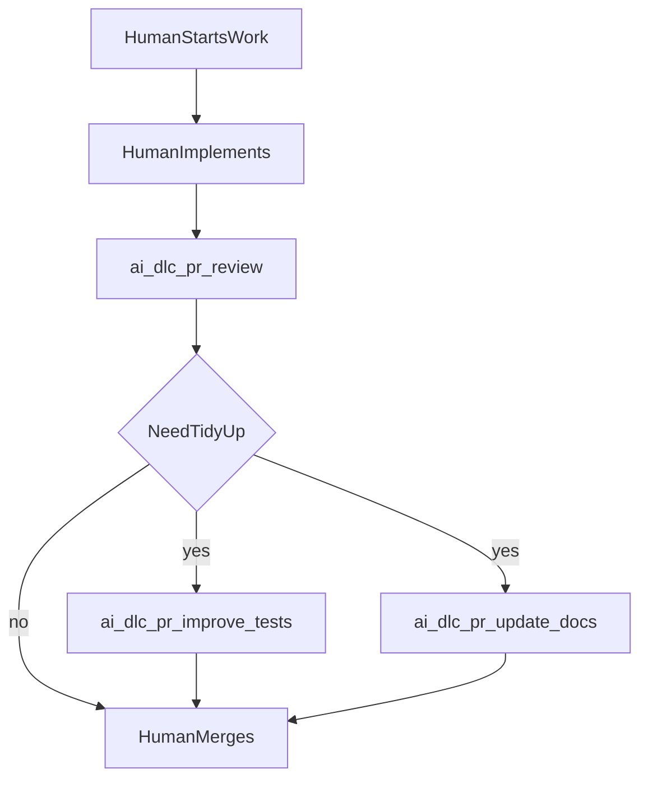

The best way to adopt **AI-DLC** is to treat it as an assistive layer around your existing engineering process, not as a replacement for it. Humans still own product intent, architecture choices, prioritization, and merge decisions. Agents are most valuable when they remove repetitive, low-ambiguity work that teams already know they should do.

## Start with boring work

If a team is adopting the marketplace for the first time, start with agents that are useful, easy to evaluate, and unlikely to disrupt delivery flow:

| Start here | Why it is low-friction |
| --- | --- |
| `pr-reviewer` | Fits naturally into existing PR review habits and does not change branch history. |
| `bug-triager` | Removes repetitive intake work by pointing to the likely subsystem, potential owner, and root-cause hints when bug reports or scanner findings are noisy. |
| `test-author` | Helps with neglected but valuable test hardening work. |
| `doc-writer` | Keeps docs from becoming post-release cleanup. |

These agents help with work that humans often postpone:

- review synthesis
- intake triage
- test hardening
- doc updates
- post-merge cleanup

## Recommended rollout order

### Stage 1: Add one review agent

Start with `ai-dlc/pr/pr-review` on active pull requests. This gives the team a concrete way to evaluate signal quality without changing how people branch, code, or merge.

### Stage 2: Add one maintenance agent

Once the team trusts the review loop, add one tidy-up helper:

- `ai-dlc/pr/improve-tests` if test hardening is commonly skipped
- `ai-dlc/pr/update-docs` if docs tend to lag behind shipping code
- `ai-dlc/issue/triage` if incoming bugs create manual backlog noise

Prefer enabling one at a time so the team can see whether each agent reduces toil or adds it.

### Stage 3: Add more structure only when needed

Bring in the issue-phase planning agents when work is:

- large or ambiguous
- cross-team or cross-service
- architecture-heavy
- regulated or high-risk

That is where `req-analyst`, `ac-writer`, `solution-architect`, `task-planner`, and `ac-verifier` become useful. They are valuable tools, but they should not feel like the default path for every small backlog item.

## Agent categories

### Core adoption agents

These are the best first candidates for most product teams.

| Agent | Default recommendation |
| --- | --- |
| `pr-reviewer` | Enable early. |
| `bug-triager` | Enable when intake is noisy and teams want help identifying likely owners from code area and recent changes. |

### Maintenance agents

These are good once the team wants AI focused on boring but useful follow-up work.

| Agent | Default recommendation |
| --- | --- |
| `test-author` | Enable for post-merge or controlled pre-merge tidy-up. |
| `doc-writer` | Enable where docs regularly drift behind code. |
| `comment-resolver` | Use carefully for clear, repetitive feedback; prefer post-merge on fast-moving PRs. |
| `postmortem-writer` | Use when incident write-ups are routinely delayed. |

### Advanced planning agents

These are best treated as optional depth, not baseline workflow.

| Agent | Default recommendation |
| --- | --- |
| `req-analyst` | Use for vague or incomplete inputs. |
| `ac-writer` | Use when acceptance criteria must be explicit and reusable. |
| `solution-architect` | Use for larger design decisions, not ordinary feature work. |
| `task-planner` | Use when decomposition is the tedious part. |
| `ac-verifier` | Use when explicit AC already exists and static verification adds value. |

### Guarded implementation agent

`implementer` should usually be treated as a guarded or advanced option. For sophisticated teams, the safer default is often:

- humans write the core code
- agents help review it
- agents handle test, doc, and comment tidy-up

If `implementer` is enabled, use it on well-bounded work where the expected behavior and safety boundaries are already clear.

For bug fixes, `implementer` is often a good fit once the team understands the problem well enough that coding is the next useful step:

- use `ai-dlc/issue/implement` directly for a small, understood bug
- use `ai-dlc/issue/triage` first when the report is noisy, incomplete, or needs likely owner / subsystem / root-cause hints
- use a deeper issue-phase path only when the bug is ambiguous, cross-team, or high-risk

In other words, the guide does not discourage `implementer` for bugs. It only avoids making implementation automation the default answer before the team has enough clarity.

## Keep the process smooth

AI-DLC adoption should not introduce a second delivery methodology. A good rollout keeps these principles in place:

- Use the lightest useful path for the work.
- Do not force every issue through every label.
- Prefer read-only agents before committer agents.
- Prefer post-merge tidy-up when branch churn would slow reviewers down.
- Add more structure only after a team has felt real value from the simpler path.

## When not to use an agent

Avoid centering agents on high-judgment work by default:

- negotiating product intent
- making architecture decisions without human review
- decomposing politically sensitive roadmap work
- autonomously coding in sensitive system areas
- deciding whether senior reviewer feedback should be declined

Those are the points where human context, authority, and trade-off judgment matter most.

## A practical default path

For many product teams, this is enough:

If that path already saves time, then consider adding issue-phase structure for the subset of work that genuinely benefits from it.

## Signs the rollout is working

- Teams understand the starting point in a few minutes.
- `pr-reviewer` comments are used, not ignored.
- Maintenance work is getting done with less human nagging.
- Teams are adopting additional agents because they want more help, not because they feel forced into a rigid process.

## See also

- [Marketplace Overview](./overview) — the marketplace index and installation paths.
- [Marketplace Overview](./overview#the-shared-language-ai-dlc-labels) — the shared label vocabulary and common agent contracts.
- [Issue Lifecycle](./issue-lifecycle) — the optional issue-phase flow for structured work.
- [PR Lifecycle](./pr-lifecycle) — the review and tidy-up flow around pull requests.
