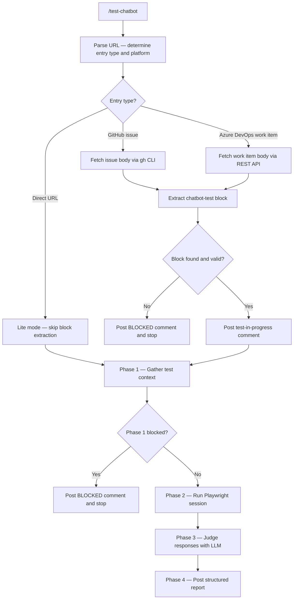

The **Chatbot Tester** plugin validates AI chatbot behaviour in any web application by running browser-based checks with **Playwright** in headless Chromium and judging Q&A accuracy with a batched LLM call.

| Phase | What it does |
| --- | --- |
| **Gather context** | Parses the input URL, fetches the issue/work item, and extracts the `chatbot-test` block containing widget hints, credentials, and Q&A pairs |
| **Run Playwright** | Opens a headless session, locates the chatbot widget, and runs six test categories |
| **Judge responses** | Sends all Q&A pairs to an LLM in a single batched call to assess functional accuracy |
| **Post report** | Computes the overall verdict and posts a structured report as a comment on the issue or work item |

Works with **GitHub** and **Azure DevOps**. Also supports a **lite mode** for direct URL runs (UI tests only, no Q&A judgment).

---

## How It Works



1. **Parse URL** — determines entry type (`issue`, `wi`, or direct URL) and platform (`GitHub`, `AzureDevOps`, `DirectURL`) from the URL pattern.
2. **Fetch artifact** — reads the GitHub issue or Azure DevOps work item body and scans it for a fenced `chatbot-test` code block. Stops with a BLOCKED comment if the block is absent or missing required fields.
3. **Post progress comment** — immediately posts a "test in progress" comment before launching the browser so the team knows the run has started.
4. **Gather context (Phase 1)** — verifies prerequisites, resolves the test URL, and determines whether a login is required.
5. **Run Playwright (Phase 2)** — writes an instrumented Python/Playwright script, opens a headless Chromium session, locates the chatbot widget using the `trigger_hint`, and runs all six test categories. Captures verbatim bot responses for each Q&A pair.
6. **Judge responses (Phase 3)** — sends all Q&A pairs in a single batched LLM call. Each pair is assessed for PASS, PARTIAL, or FAIL based on the `must_contain` terms.
7. **Publish report (Phase 4)** — posts one structured report back to the issue or work item. For direct URL runs, writes `chatbot-test-report.md` to the current directory.

---

## Test Categories

| # | Category | Full test | Lite mode |
| --- | --- | --- | --- |
| 1 | **UI Availability** | Widget loads, trigger button works, input field is interactable | Same |
| 2 | **Functional Accuracy** | Q&A pairs judged by LLM against `must_contain` terms | Skipped |
| 3 | **Fallback Handling** | Gibberish and out-of-scope inputs — bot responds gracefully | Same |
| 4 | **Response Latency** | Time from message sent to response complete (30s limit) | Same |
| 5 | **Conversation Continuity** | Follow-up question retains context from previous response | Same |
| 6 | **Empty Input Handling** | Blank message submission is handled gracefully | Same |

---

## Inputs

| Input | Source | Required | Description |
| --- | --- | --- | --- |
| Target URL | Command argument | Yes | GitHub issue URL, Azure DevOps work item URL, or a direct app URL |
| `chatbot-test` block | Issue / work item body | Yes (except lite mode) | JSON block with widget hints, optional credentials, and optional Q&A pairs |
| Test password | Xianix Agentri Studio Secrets | No | Referenced by `password_env` in the credentials block — never stored in the issue body |

---

## Test Case Block

Add this block to a **GitHub issue** or **Azure DevOps work item** body. The plugin reads it automatically — no local files needed.

````text
```chatbot-test
{
  "url": "https://your-app-url.com",
  "widget": {
    "trigger_hint": "blue chat button in the bottom right corner",
    "ready_hint": "input field shows placeholder text 'Type your question...'",
    "response_done_hint": "send button becomes clickable again"
  },
  "credentials": {
    "username": "test@example.com",
    "password_env": "CHATBOT-TEST-PASSWORD"
  },
  "knowledge": [
    {
      "question": "What are your opening hours?",
      "must_contain": ["9am", "5pm", "Monday"]
    }
  ]
}
```
````

| Field | Required | Description |
| --- | --- | --- |
| `url` | Yes | The web app URL to open |
| `widget.trigger_hint` | Yes | Plain-language description of how to open the chatbot (colour, position, icon) |
| `widget.ready_hint` | Yes | Plain-language description of when the input field is ready |
| `widget.response_done_hint` | Yes | Plain-language description of when the bot has finished responding |
| `credentials.username` | No | Login email for apps requiring authentication |
| `credentials.password_env` | No | Key name of the Xianix Agentri Studio Secret holding the password |
| `knowledge` | No | Array of Q&A pairs. Each entry needs `question` and `must_contain` (array of required terms). Omit to skip Functional Accuracy. |

---

## Sample Prompts

**Test a GitHub issue:**

```text
/test-chatbot https://github.com/owner/repo/issues/42
```

**Test an Azure DevOps work item:**

```text
/test-chatbot https://dev.azure.com/org/project/_workitems/edit/1234
```

**Lite mode — direct URL (UI tests only):**

```text
/test-chatbot https://staging.example.com
```

*(No `chatbot-test` block needed for lite mode. Functional Accuracy is skipped and the report is written locally as `chatbot-test-report.md`.)*

---

## Environment Variables

The Xianix Agent reads these from its secrets store and injects them at runtime via the rule's `with-envs` block. For local CLI use, export them in your shell.

| Variable | Platform | Required | Purpose |
| --- | --- | --- | --- |
| `GITHUB-TOKEN` | GitHub | Yes | Authenticate `gh` CLI for fetching issue content and posting comments |
| `AZURE-DEVOPS-TOKEN` | Azure DevOps | Yes | PAT for the ADO REST API — reading work items and posting comments |
| `CHATBOT-TEST-PASSWORD` | Both | No | Password for apps requiring login. Only needed when `credentials.password_env` is set in the test case block |

### GitHub Token Permissions

| Permission | Access | Why it's needed |
| --- | --- | --- |
| **Metadata** | Read | Resolve repository owner and name |
| **Issues** | Read & Write | Fetch issue body and post test report comments |

### Azure DevOps PAT Permissions

Create the token in **User Settings → Personal access tokens** with the following scopes:

| Scope | Access | Why it's needed |
| --- | --- | --- |
| **Work Items** | Read & Write | Fetch work item body and post report comments |

---

## Verdict Logic

### Category Verdicts

| Category | Verdict logic |
| --- | --- |
| UI Availability | Direct from Phase 2 (structural check — no LLM judgment) |
| Functional Accuracy | PASSED if all pairs PASS; PARTIAL if any PARTIAL and no FAIL; FAILED if any FAIL |
| Fallback Handling | PASSED if all probes PASS; FAILED if any probe FAILS; BLOCKED if no response was captured |
| Response Latency | PASSED if all responses complete within 30s; FAILED if any exceeded the timeout |
| Conversation Continuity | From LLM judge verdict (PASS / PARTIAL / FAIL) |
| Empty Input Handling | Direct from probe verdict |

### Overall Verdict

| Condition | Overall Verdict |
| --- | --- |
| All categories PASSED | **PASSED** |
| Any category PARTIAL, no FAILED or BLOCKED | **PARTIAL** |
| Any category FAILED or BLOCKED | **FAILED** |
| Login failed | **BLOCKED** |

---

## Safety Rules

- Credentials, tokens, and secrets are never included in posted comments.
- The temporary working directory (`_cbt_run/`) is deleted after every run, even if execution fails.
- If `password_env` is set but the secret is not found, the run reports BLOCKED rather than attempting an unauthenticated session.

---

## Report Output

The plugin posts one comment with:

- URL tested
- overall verdict
- per-category status table
- collapsible detail block for each Q&A pair (Functional Accuracy)
- detail blocks for any failing fallback, continuity, or empty input probes
- a lite-mode callout when Functional Accuracy was skipped

For direct URL runs, the same content is written to `chatbot-test-report.md` in the current directory instead of posted as a comment.

---

## Quick Start

```bash
# Point Claude Code at the plugin
claude --plugin-dir /path/to/xianix-plugins-official/plugins/chatbot-tester

# Then in chat
/test-chatbot https://github.com/owner/repo/issues/42
```

Or trigger it automatically via the Xianix Agent by adding a rule — see the examples below and the [Rules Configuration](/agent-configuration/rules/) guide.

For setup details (Python 3.10+, Playwright Python package, `gh` CLI, and ADO PAT), see the plugin setup guide in the repository:

<https://github.com/xianix-team/plugins-official/tree/main/plugins/chatbot-tester/docs/setup.md>

---

## Rule Examples

Add the execution block below to your `rules.json` so the Xianix Agent automatically tests chatbots when a webhook fires.

### When does the agent trigger?

The Chatbot Tester is **tag-driven**. It runs when the `ai-dlc/issue/test-chatbot` label is present on an issue and one of the scenarios below fires (OR logic across `match-any` entries).

| Scenario | What it covers |
| --- | --- |
| Issue opened with the tag already present | An issue is created with the tag included from the start |
| Tag newly applied to an open issue | A human (or another rule) adds `ai-dlc/issue/test-chatbot` to an open issue |

| Platform | Scenario | Webhook event | Filter rule |
| --- | --- | --- | --- |
| GitHub | Tag newly applied | `issues` | `action==labeled` and `label.name=='ai-dlc/issue/test-chatbot'` |
| GitHub | Issue opened with tag | `issues` | `action==opened` and `ai-dlc/issue/test-chatbot` is in `issue.labels` |

### Execution-block shape

| Field | Purpose |
| --- | --- |
| `name` | Human-readable id for the execution |
| `platform` | `"github"` or `"azure-devops"` — drives which provider the plugin uses |
| `repository.url` | Webhook path to the repository URL |
| `repository.ref` | Webhook path to the branch ref |
| `match-any` | Array of trigger filters — first one to match wins |
| `use-inputs` | Entry-point id (e.g. `issue-url`) |
| `use-plugins` | The plugin to invoke |
| `with-envs` | Required environment variables, sourced from the agent's `secrets.*` store |
| `execute-prompt` | The prompt sent to the agent |

### GitHub

```json
{
  "name": "github-chatbot-test",
  "platform": "github",
  "repository": {
    "url": "repository.clone_url",
    "ref": "repository.default_branch"
  },
  "match-any": [
    {
      "name": "github-issue-tag-applied",
      "rule": "action==labeled&&label.name=='ai-dlc/issue/test-chatbot'"
    },
    {
      "name": "github-issue-opened-with-tag",
      "rule": "action==opened&&'ai-dlc/issue/test-chatbot' in issue.labels[*].name"
    }
  ],
  "use-inputs": [
    { "name": "issue-url", "value": "issue.html_url" }
  ],
  "use-plugins": [
    {
      "plugin-name": "chatbot-tester@xianix-plugins-official",
      "marketplace": "xianix-team/plugins-official"
    }
  ],
  "with-envs": [
    { "name": "GITHUB-TOKEN", "value": "secrets.GITHUB-TOKEN", "mandatory": true },
    { "name": "CHATBOT-TEST-PASSWORD", "value": "secrets.CHATBOT-TEST-PASSWORD", "mandatory": false }
  ],
  "execute-prompt": "Run /test-chatbot {{issue-url}} to perform the automated chatbot test."
}
```

### Azure DevOps

```json
{
  "name": "ado-chatbot-test",
  "platform": "azure-devops",
  "repository": {
    "url": "resource.url",
    "ref": "resource.fields.System.TeamProject"
  },
  "match-any": [
    {
      "name": "ado-workitem-tag-applied",
      "rule": "eventType==workitem.updated&&resource.fields['System.Tags'] contains 'ai-dlc/issue/test-chatbot'"
    }
  ],
  "use-inputs": [
    { "name": "workitem-url", "value": "resource._links.html.href" }
  ],
  "use-plugins": [
    {
      "plugin-name": "chatbot-tester@xianix-plugins-official",
      "marketplace": "xianix-team/plugins-official"
    }
  ],
  "with-envs": [
    { "name": "AZURE-DEVOPS-TOKEN", "value": "secrets.AZURE-DEVOPS-TOKEN", "mandatory": true },
    { "name": "CHATBOT-TEST-PASSWORD", "value": "secrets.CHATBOT-TEST-PASSWORD", "mandatory": false }
  ],
  "execute-prompt": "Run /test-chatbot {{workitem-url}} to perform the automated chatbot test."
}
```

:::note
These blocks go inside the `executions` array of a rule set. See [Rules Configuration](/agent-configuration/rules/) for the full file structure and filter syntax.
:::

---

## What Is Included

| Path | Purpose |
| --- | --- |
| `commands/test-chatbot.md` | Entry command, argument pattern, and test case block reference |
| `agents/orchestrator.md` | End-to-end orchestration flow across four phases |
| `skills/gather-test-context/SKILL.md` | Phase 1 — prerequisite checks and login detection |
| `skills/run-playwright-session/SKILL.md` | Phase 2 — headless browser session and six test categories |
| `skills/judge-responses/SKILL.md` | Phase 3 — batched LLM verdict for Q&A pairs |
| `skills/post-test-report/SKILL.md` | Phase 4 — report construction and posting |
| `providers/github.md` | GitHub fetch/post operations via `gh` CLI |
| `providers/azure-devops.md` | Azure DevOps fetch/post operations via REST API |
| `styles/report-template.md` | Strict output report format with verdict icons and section rules |
| `docs/verdict-logic.md` | Authoritative category and overall verdict computation rules |
| `hooks/validate-prerequisites.sh` | Python 3.10+, `playwright` Python package, and platform CLI availability checks |
| `docs/setup.md` | Installation, auth setup, and test case authoring guide |
