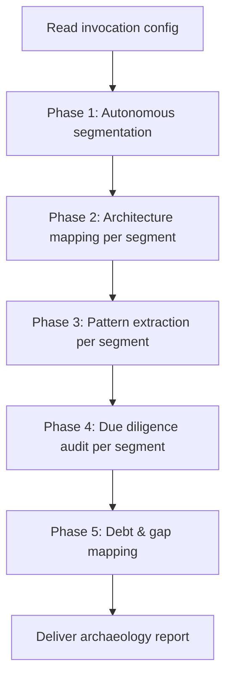

The **Code Archaeology Agent** performs a structured, phased analysis of an existing codebase — entirely on its own. It maps architecture in business language, extracts actual coding conventions from representative files, audits for defects and structural problems, and classifies all identified work into a prioritized backlog.

The agent runs **without interactive guidance**. Developers provide an optional invocation configuration, the agent runs to completion across all phases, and they consume a single structured report.

It is designed to run **before AI-assisted development begins** — to establish coding standards, identify forbidden zones, seed a work backlog, and define blast radius controls.

---

## What You Get Back

The agent produces one complete archaeology report delivered to `ai-dlc/reports/code-archaeology-analysis.md`. The report covers:

- **Segment map** — how the agent divided the codebase and the confidence level assigned to each segment boundary.
- **Architecture summary** — business-language descriptions of what each module does, what data it owns, what it calls, and what it exposes — plus service boundaries, integration points, and data flows.
- **Coding conventions** — the observed standard for each pattern type (naming, error handling, ORM access, API shape, authentication, testing, dependency wiring, configuration). Each convention is marked Confirmed, Inconsistency, or Split.
- **Due diligence findings** — defects, design violations, security gaps, fragile patterns, and test blind spots, grouped by severity (Critical → Low) with a recommendation for each.
- **Work backlog** — all identified work classified as Enhancement, Remediation, or Migration, prioritized P1–P5 with dependencies noted.
- **Recommended next steps** — immediate actions before new development, conventions safe to encode as coding rules, and items that require a human decision.
- **Confidence assessment** — per-dimension confidence ratings and a list of every area the agent did not analyze.
- **Autonomous decision log** — every judgment call the agent made during execution, making the analysis fully auditable.

---

## How It Works



1. **Read invocation config** — the agent reads any provided focus areas, skip areas, or segment limits. If none are provided, it applies autonomous defaults for every decision.
2. **Phase 1 — Segmentation** — reads the top-level directory structure and divides the codebase into analyzable segments (roughly 15–25 files each), grouping files by cohesion rather than by file count.
3. **Phase 2 — Architecture mapping** — for each segment, reads every source file and produces module descriptions in business language, service boundary rules, integration points, and end-to-end data flow traces.
4. **Phase 3 — Pattern extraction** — samples 10–20 representative files per segment (at least one per module, one controller or handler, one service or use-case, one data access layer file, and one test file) and records the observed convention for each pattern type with a consistency verdict.
5. **Phase 4 — Due diligence audit** — actively looks for logic defects, design violations, security gaps, fragile patterns, test blind spots, and consistency breaks. Assigns a severity and a recommendation (Fix-in-place, Quarantine, or Encode as prohibition) for every finding.
6. **Phase 5 — Debt & gap mapping** — classifies all identified work as Enhancement, Remediation, or Migration and prioritizes using a P1–P5 scheme tied to blocking risk.
7. **Deliver report** — compiles all phases into one structured report with a decision log appended.

---

## Invocation

The agent accepts an optional configuration block. Every field is optional — the agent applies autonomous defaults for any omitted input.

| Input | Required | Default behavior |
|---|---|---|
| Repository | No | Uses the connected repository |
| Focus areas | No | Prioritizes recently modified files, modules with the highest inbound dependency count, and modules with business-critical names (auth, payments, orders, core, api) |
| Skip areas | No | Auto-excludes `node_modules/`, `vendor/`, `dist/`, `build/`, `.git/`, generated migration files, and folders where >90% of files are third-party or auto-generated |
| Max segments | No | Determined autonomously based on codebase size |

---

## Sample Prompt

With optional focus and skip configuration:

```text
ARCHAEOLOGY AGENT — START

Repository: .
Focus areas: src/auth, src/payments
Skip areas: src/legacy
Max segments: 8
```

Fully autonomous with no configuration:

```text
ARCHAEOLOGY AGENT — START
```

---

## What the Agent Cannot Do

Some decisions require human judgment. The agent flags these explicitly in the report rather than guessing.

| Limitation | What to do |
|---|---|
| Resolve Split coding conventions (two competing standards exist with neither dominant) | Have a senior engineer review the Split patterns table and decide before writing coding rules |
| Confirm business logic correctness | Have domain experts review Critical and High logic defect findings |
| Assess test quality beyond structure | Have engineers review the test blind spots section |
| Analyze runtime behavior (static analysis only) | Run the test suite and review monitoring dashboards alongside the report |
| Evaluate security in depth | Run a dedicated security scanner in parallel with this report |

---

## Environment Variables

The Xianix Agent reads these from its secrets store and injects them at runtime via the rule's `with-envs` block. For local CLI use, export them in your shell.

| Variable | Platform | Required | Purpose |
|---|---|---|---|
| `GITHUB-TOKEN` | GitHub | Yes | Authenticate `gh` CLI for repository access |
| `AZURE-DEVOPS-TOKEN` | Azure DevOps | Yes | PAT for REST API calls to read repository content |

---

## Quick Start

```bash
# Point Claude Code at the plugin
claude --plugin-dir /path/to/xianix-plugins-official/plugins/code-archaeology-agent

# Then in the chat
ARCHAEOLOGY AGENT — START

Repository: .
```

Or trigger it automatically via the Xianix Agent by adding a rule — see the examples below and the [Rules Configuration](/agent-configuration/rules/) guide.

---

## Rule Examples

Add one (or both) of the execution blocks below to your `rules.json` so the Xianix Agent runs codebase archaeology when a webhook fires.

### When does the agent trigger?

The Code Archaeology Agent is triggered **on demand** — it does not react to commit events or CI runs. The trigger mechanism differs per platform:

- **GitHub** — **label-driven**. Add the `ai-dlc/repo/archaeology` label to an issue in the target repository.
- **Azure DevOps** — **assignment-driven**. Create an `Analysis Task` work item and **assign it to `xianix-agent <xianix-agent@99x.io>`**.

| Platform | Scenario | Webhook event | Filter rule |
|---|---|---|---|
| GitHub | Label applied to issue | `issues` | `action==labeled` and `label.name=='ai-dlc/repo/archaeology'` |
| Azure DevOps | Analysis Task assigned to agent | `workitem.updated` | `resource.fields."System.AssignedTo".newValue=='xianix-agent <xianix-agent@99x.io>'` and `resource.revision.fields."System.WorkItemType"=='Analysis Task'` |

### Execution-block shape

Each execution block in `rules.json` follows this top-level shape:

| Field | Purpose |
|---|---|
| `name` | Human-readable id for the execution |
| `platform` | `"github"` or `"azuredevops"` — drives which provider the plugin uses |
| `repository.url` | Webhook path to the repository URL (e.g. `repository.clone_url`) |
| `match-any` | Array of trigger filters — first one to match wins |
| `use-plugins` | The plugin to invoke |
| `with-envs` | Required environment variables, sourced from the agent's `secrets.*` store and marked `mandatory: true` |
| `execute-prompt` | The prompt sent to the agent. Supports `{{repository-name}}` interpolation from the `repository` block |

### GitHub

```json
{
  "name": "github-repo-archaeology",
  "platform": "github",
  "repository": {
    "url": "repository.clone_url"
  },
  "match-any": [
    {
      "name": "github-archaeology-label-applied",
      "rule": "action==labeled&&label.name=='ai-dlc/repo/archaeology'"
    }
  ],
  "use-inputs": [],
  "use-plugins": [
    {
      "plugin-name": "code-archaeology-agent@xianix-plugins-official",
      "marketplace": "xianix-team/plugins-official"
    }
  ],
  "with-envs": [
    { "name": "GITHUB-TOKEN", "value": "secrets.GITHUB-TOKEN", "mandatory": true }
  ],
  "execute-prompt": "A codebase archaeology analysis has been requested for {{repository-name}}.\n\nARCHAEOLOGY AGENT — START\n\nRepository: .\n"
}
```

### Azure DevOps

```json
{
  "name": "azuredevops-repo-archaeology",
  "platform": "azuredevops",
  "match-any": [
    {
      "name": "azuredevops-archaeology-task-assigned",
      "rule": "eventType==workitem.updated&&resource.fields.\"System.AssignedTo\".newValue=='xianix-agent <xianix-agent@99x.io>'&&resource.revision.fields.\"System.WorkItemType\"=='Analysis Task'"
    }
  ],
  "use-inputs": [],
  "use-plugins": [
    {
      "plugin-name": "code-archaeology-agent@xianix-plugins-official",
      "marketplace": "xianix-team/plugins-official"
    }
  ],
  "with-envs": [
    { "name": "AZURE-DEVOPS-TOKEN", "value": "secrets.AZURE-DEVOPS-TOKEN", "mandatory": true }
  ],
  "execute-prompt": "A codebase archaeology analysis has been requested.\n\nARCHAEOLOGY AGENT — START\n\nRepository: .\n"
}
```

:::note
These blocks go inside the `executions` array of a rule set. See [Rules Configuration](/agent-configuration/rules/) for the full file structure and filter syntax.
:::
