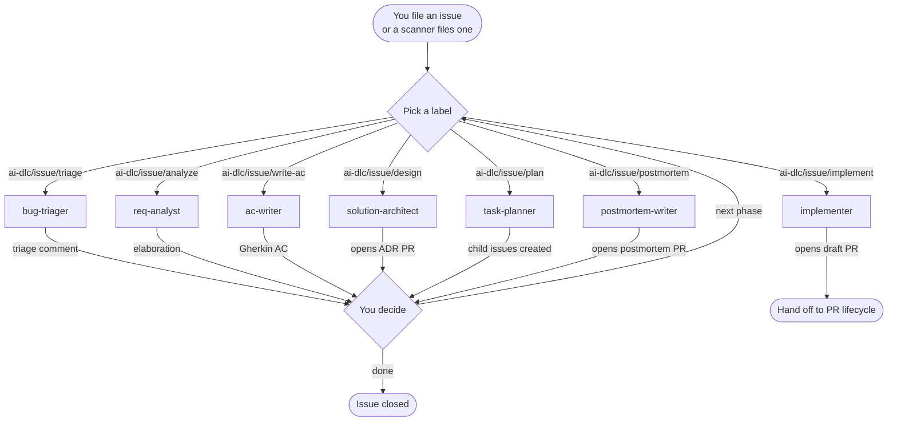
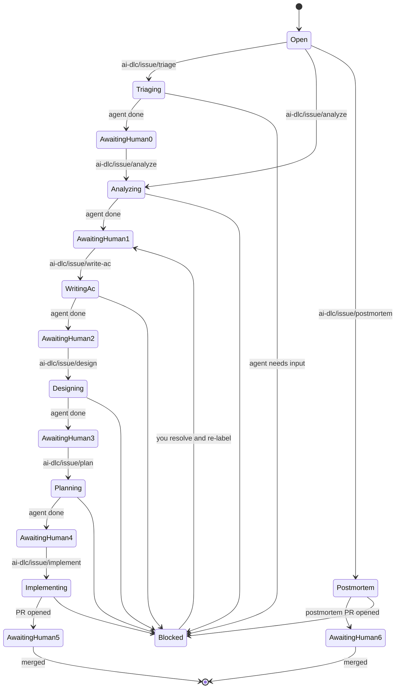
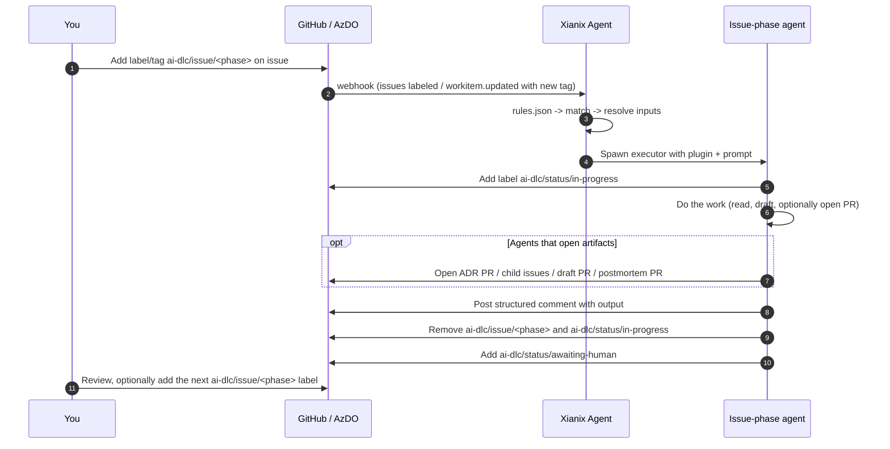

Before any code is written, a backlog item can travel through the **issue-phase agents**. They share the same `ai-dlc/*` vocabulary used across the rest of AI-DLC, all under the dedicated `ai-dlc/issue/*` namespace, and every trigger, every comment, and every artifact is scoped to a single issue or work item.

This page is the deep dive on that phase: the overall flow, then a per-agent breakdown of what fires it, what it does, and what it produces — written so the same workflow works on **GitHub** and **Azure DevOps**. Treat it as an optional structure for complex work, not a mandatory checklist for every backlog item.

:::tip[Same labels, different surfaces]
On GitHub the trigger is a **label** added to the issue. On Azure DevOps it's a **tag** added to the work item. The agent rules normalise both into the same `ai-dlc/issue/*` vocabulary, so the workflow you see below is identical on either platform.
:::

:::note[Namespace recap]
Issue-phase triggers all live under `ai-dlc/issue/*`. Status labels set by agents (`ai-dlc/status/in-progress`, `ai-dlc/status/awaiting-human`, `ai-dlc/status/blocked`) are shared with the rest of the lifecycle. See the [Marketplace Overview labels table](/official-plugins/overview/#the-shared-language-ai-dlc-labels) for the full list.
:::

---

## The issue-phase agents at a glance

| Agent | Trigger label / tag | Posts | Opens |
|---|---|---|---|
| `req-analyst` | `ai-dlc/issue/analyze` | Structured elaboration comment(s) | — |
| `ac-writer` | `ai-dlc/issue/write-ac` | Gherkin acceptance criteria comment | — |
| `solution-architect` | `ai-dlc/issue/design` | Design summary comment | ADR pull request |
| `task-planner` | `ai-dlc/issue/plan` | Plan summary comment | Child issues / work items |
| `implementer` | `ai-dlc/issue/implement` | Implementation summary comment | Draft pull request |
| `bug-triager` | `ai-dlc/issue/triage` | Triage comment with severity, potential owner, and root-cause hints | — |
| `postmortem-writer` | `ai-dlc/issue/postmortem` | Postmortem summary comment | Postmortem pull request |

The phase is **structured when you need it** — each agent expects the previous step's output to exist if you choose to use that step, but you can skip straight to a later label whenever the prior artifacts are already in place.

:::tip[Use issue-phase depth selectively]
For many teams, the issue-phase agents are most useful on large, ambiguous, regulated, or cross-team work. Small, obvious changes can go straight to implementation and review without forcing extra handoffs.
:::

:::note[Triggers fire on addition only]
Every rule in this page is scoped to the **moment a label or tag is added** — not to the issue having that label later on. On GitHub this is enforced by `action==labeled` plus a `label.name==…` match; on Azure DevOps it's enforced by checking that the tag appears in the new `resource.revision.fields["System.Tags"]` value but not in the prior one. As a result, an agent runs **exactly once** per label/tag application: re-running it means removing the label/tag and adding it again.
:::

---

## The overall workflow

Every arrow leaving an agent represents the agent **removing its trigger label**, **posting a structured comment** (and opening a PR or child issues, where applicable), and **adding `ai-dlc/status/awaiting-human`**. Every arrow leaving a human represents a single label/tag change.

Once `implementer` opens a draft PR, the conversation moves to the **[PR Lifecycle](/official-plugins/pr-lifecycle/)** — where `pr-reviewer`, `ac-verifier`, `comment-resolver`, `test-author`, and `doc-writer` take over.

:::note[This is the fullest path, not the default for every item]
The diagram above shows the most structured path through issue work. Teams that want a lighter workflow often use only `bug-triager` for noisy intake, `req-analyst` for ambiguous work, or `implementer` for well-bounded tasks that are already understood.
:::

---

## State machine

The same issue moves through phases by label transitions alone. You can skip phases by jumping straight to a later label when the extra structure would slow the team down more than it would help.

:::tip[Continuous → Lifecycle handoff]
A continuous-review scanner (security, performance, dependencies, …) opens its findings as issues already labelled `ai-dlc/issue/triage`. From there it's a normal ping-pong: triage → analyze → design → plan → implement → review → merge.
:::

---

## Per-agent breakdown

Each agent below uses the same shape: **Triggers** (how it's invoked on each platform), **Activities** (what it does once invoked), and **Outputs** (what you'll find on the issue when it's done).

### `req-analyst`

The first responder to a fresh idea. Reads the raw issue, asks "what does the user actually need and why," and produces a structured elaboration. Full plugin reference: [Requirement Analyst](/official-plugins/req-analyst/).

Best used when the input is vague, incomplete, or spread across comments and linked artifacts.

#### Triggers

| Platform | Surface | What you do | Webhook event the rule matches |
|---|---|---|---|
| **GitHub** | Label on the issue | Add `ai-dlc/issue/analyze` | `issues` where `action==labeled` **and** the just-added `label.name=='ai-dlc/issue/analyze'` (fires once per addition, not on later issue updates) |
| **Azure DevOps** | Tag on the work item | Add `ai-dlc/issue/analyze` | `workitem.updated` where the new tag appearing in `resource.revision.fields["System.Tags"]` (and not in `resource.fields["System.Tags"].oldValue`) is `ai-dlc/issue/analyze` |

#### Activities

1. Detects platform from `git remote` (GitHub vs Azure DevOps).
2. Fetches the issue / work item body, comments, and linked context.
3. Indexes project documentation (READMEs, specs, manifests) for a project summary.
4. Classifies the requirement (type, domain, complexity).
5. Runs **four analysts in parallel**: intent, domain, journey, persona.
6. Runs a **gap & risk** pass on top of the parallel output.
7. Adds `ai-dlc/status/in-progress` while running, removes it on completion.

#### Outputs

- A set of **structured comments** on the issue — one per analyst — and a final summary comment with a verdict (`GROOMED`, `NEEDS CLARIFICATION`, or `NEEDS DECOMPOSITION`).
- For unsupported platforms only, a `requirement-elaboration-report.md` file written to the workspace.
- Removes `ai-dlc/issue/analyze`, adds `ai-dlc/status/awaiting-human`.
- **No commits.** This agent is strictly read-only on the repo.

---

### `ac-writer`

Turns approved requirements into precise Given/When/Then scenarios. Output is editable Gherkin you can drop straight into your test suite — and it's what `ac-verifier` reads on the PR side later on.

Best used when acceptance criteria need to become an explicit shared artifact, not as a mandatory step for every small change.

#### Triggers

| Platform | Surface | What you do | Webhook event the rule matches |
|---|---|---|---|
| **GitHub** | Label on the issue | Add `ai-dlc/issue/write-ac` | `issues` where `action==labeled` **and** the just-added `label.name=='ai-dlc/issue/write-ac'` (fires once per addition, not on later issue updates) |
| **Azure DevOps** | Tag on the work item | Add `ai-dlc/issue/write-ac` | `workitem.updated` where the new tag appearing in `resource.revision.fields["System.Tags"]` (and not in `resource.fields["System.Tags"].oldValue`) is `ai-dlc/issue/write-ac` |

The agent expects `req-analyst`'s elaboration to already be present on the issue. If it isn't, the agent will ask you to run `ai-dlc/issue/analyze` first.

#### Activities

1. Reads the elaborated requirements left by `req-analyst`.
2. Drafts Gherkin scenarios for each user journey, including happy path, error paths, and edge cases.
3. Cross-references project conventions (existing test files, scenario style) so the output matches.
4. Adds `ai-dlc/status/in-progress` while running, removes it on completion.

#### Outputs

- A **single Gherkin acceptance-criteria comment** on the issue, ready to be edited and approved.
- Removes `ai-dlc/issue/write-ac`, adds `ai-dlc/status/awaiting-human`.
- **No commits.** This agent is strictly read-only on the repo.

---

### `solution-architect`

Proposes a concrete approach: an Architecture Decision Record (ADR), a Mermaid component sketch, and a list of files likely to change. Opens the ADR as its own pull request so the design itself goes through the standard review loop.

Best used for work that crosses services, teams, or architectural boundaries. On straightforward feature work, a human design note may be enough.

#### Triggers

| Platform | Surface | What you do | Webhook event the rule matches |
|---|---|---|---|
| **GitHub** | Label on the issue | Add `ai-dlc/issue/design` | `issues` where `action==labeled` **and** the just-added `label.name=='ai-dlc/issue/design'` (fires once per addition, not on later issue updates) |
| **Azure DevOps** | Tag on the work item | Add `ai-dlc/issue/design` | `workitem.updated` where the new tag appearing in `resource.revision.fields["System.Tags"]` (and not in `resource.fields["System.Tags"].oldValue`) is `ai-dlc/issue/design` |

#### Activities

1. Reads the elaboration from `req-analyst` and the AC from `ac-writer`.
2. Surveys the existing codebase for relevant modules, patterns, and constraints.
3. Drafts an **Architecture Decision Record** (context, options considered, decision, consequences).
4. Adds a Mermaid component sketch and a likely change list.
5. Cuts a branch, commits the ADR, and **opens a pull request** linked back to the issue.
6. Adds `ai-dlc/status/in-progress` while running, removes it on completion.

#### Outputs

- A **summary comment** on the issue with a link to the ADR pull request.
- An **ADR pull request** that goes through the normal [PR Lifecycle](/official-plugins/pr-lifecycle/) — you can run `ai-dlc/pr/pr-review` on it just like any other PR.
- Removes `ai-dlc/issue/design`, adds `ai-dlc/status/awaiting-human`.

---

### `task-planner`

Splits an approved epic into individually actionable child issues, copies the AC into each, and links them back to the parent.

Best used for decomposition-heavy work where breaking down the backlog is itself the tedious part.

#### Triggers

| Platform | Surface | What you do | Webhook event the rule matches |
|---|---|---|---|
| **GitHub** | Label on the issue | Add `ai-dlc/issue/plan` | `issues` where `action==labeled` **and** the just-added `label.name=='ai-dlc/issue/plan'` (fires once per addition, not on later issue updates) |
| **Azure DevOps** | Tag on the work item | Add `ai-dlc/issue/plan` | `workitem.updated` where the new tag appearing in `resource.revision.fields["System.Tags"]` (and not in `resource.fields["System.Tags"].oldValue`) is `ai-dlc/issue/plan` |

#### Activities

1. Reads the elaboration, AC, and (if present) ADR linked to the parent issue.
2. Decomposes the work into smaller, individually actionable child items.
3. For each child, writes a focused title, description, and a slice of the parent's AC.
4. **Creates the child issues / work items** and links them back to the parent.
5. Adds `ai-dlc/status/in-progress` while running, removes it on completion.

#### Outputs

- A **plan summary comment** on the parent issue with a checklist of links to every child created.
- One **new issue / work item per child task**, each pre-populated with its slice of the AC and ready to be picked up with `ai-dlc/issue/implement`.
- Removes `ai-dlc/issue/plan`, adds `ai-dlc/status/awaiting-human`.

---

### `implementer`

The big one. Opens a branch, writes the code and tests against the agreed AC, and pushes a **draft** pull request. Always draft — a human inspects the diff before flipping it to ready-for-review.

This agent is best treated as a guarded option for well-bounded work. Many sophisticated teams will prefer to keep humans in the driver's seat for product direction and implementation, while using AI more heavily on review support and tidy-up work.

#### Triggers

| Platform | Surface | What you do | Webhook event the rule matches |
|---|---|---|---|
| **GitHub** | Label on the issue | Add `ai-dlc/issue/implement` | `issues` where `action==labeled` **and** the just-added `label.name=='ai-dlc/issue/implement'` (fires once per addition, not on later issue updates) |
| **Azure DevOps** | Tag on the work item | Add `ai-dlc/issue/implement` | `workitem.updated` where the new tag appearing in `resource.revision.fields["System.Tags"]` (and not in `resource.fields["System.Tags"].oldValue`) is `ai-dlc/issue/implement` |

#### Activities

1. Reads the AC and any ADR linked to the issue.
2. Cuts a feature branch from the default branch.
3. Implements the change, including baseline tests against each acceptance criterion (TDD-style where practical), within the bounds already agreed by humans.
4. Runs the test suite locally inside its sandbox to confirm everything passes.
5. Pushes the branch and **opens a draft pull request** linked back to the issue (e.g. `Closes #42` or `AB#42`).
6. Adds `ai-dlc/status/in-progress` while running, removes it on completion.

#### Outputs

- A **summary comment** on the issue with a link to the draft PR.
- A **draft pull request** that hands off to the [PR Lifecycle](/official-plugins/pr-lifecycle/) — once you mark it ready, you can apply `ai-dlc/pr/pr-review`, `ai-dlc/pr/verify-ac`, and the rest.
- Removes `ai-dlc/issue/implement`, adds `ai-dlc/status/awaiting-human`.

---

### `bug-triager`

For incoming bugs (whether reported by a human or escalated by a continuous scanner): classifies severity, inspects the likely affected area of the codebase, asks reproduction questions, and prepares the issue for the lifecycle.

This is one of the lowest-friction issue agents because it removes repetitive intake work without taking product or architecture decisions away from the team. Its job is to narrow the search space: likely subsystem, potential owner, and plausible root-cause hints, not to present a final diagnosis as fact.

#### Triggers

| Platform | Surface | What you do | Webhook event the rule matches |
|---|---|---|---|
| **GitHub** | Label on the issue | Add `ai-dlc/issue/triage` | `issues` where `action==labeled` **and** the just-added `label.name=='ai-dlc/issue/triage'` (fires once per addition, not on later issue updates) |
| **Azure DevOps** | Tag on the work item | Add `ai-dlc/issue/triage` | `workitem.updated` where the new tag appearing in `resource.revision.fields["System.Tags"]` (and not in `resource.fields["System.Tags"].oldValue`) is `ai-dlc/issue/triage` |

Continuous scanners file new findings already labelled `ai-dlc/issue/triage`, so this agent is also the entry point for everything they surface.

#### Activities

1. Reads the bug report, attached logs, and any linked artifacts.
2. Classifies **severity** and **type** (regression, flake, security, performance, …).
3. Inspects the most relevant code area, related tests, and recent change history to identify the likely subsystem involved.
4. Suggests a potential owner from `CODEOWNERS`, the affected code area, and recent contributors in that area (or the equivalent signals on Azure DevOps).
5. Provides a bounded **root-cause hint** when the evidence supports one clearly enough to help triage.
6. Asks for missing **reproduction details** if the report is incomplete.
7. Adds `ai-dlc/status/in-progress` while running, removes it on completion.

#### Outputs

- A **triage comment** with severity, type, likely subsystem, potential owner, root-cause hint (when available), and either a reproduction or a list of questions for the reporter.
- A **suggested next step** at the bottom of the comment — typically `ai-dlc/issue/analyze` to enter the standard lifecycle, or `ai-dlc/status/blocked` while waiting on the reporter.
- Removes `ai-dlc/issue/triage`, adds `ai-dlc/status/awaiting-human`.
- **No commits.** This agent is strictly read-only on the repo.

---

### `postmortem-writer`

After an incident is resolved, drafts a postmortem pull request — timeline, root cause, action items — ready for the team to refine.

#### Triggers

| Platform | Surface | What you do | Webhook event the rule matches |
|---|---|---|---|
| **GitHub** | Label on the issue | Add `ai-dlc/issue/postmortem` | `issues` where `action==labeled` **and** the just-added `label.name=='ai-dlc/issue/postmortem'` (fires once per addition, not on later issue updates) |
| **Azure DevOps** | Tag on the work item | Add `ai-dlc/issue/postmortem` | `workitem.updated` where the new tag appearing in `resource.revision.fields["System.Tags"]` (and not in `resource.fields["System.Tags"].oldValue`) is `ai-dlc/issue/postmortem` |

#### Activities

1. Reads the incident issue, linked alerts, related PRs, and any chat transcripts referenced in the issue body.
2. Reconstructs a **timeline** from commit, deploy, and incident-channel timestamps.
3. Drafts **what happened**, **root cause**, **impact**, and **action items** sections in the project's existing postmortem template.
4. Cuts a branch, commits the postmortem, and **opens a pull request** linked back to the incident issue.
5. Adds `ai-dlc/status/in-progress` while running, removes it on completion.

#### Outputs

- A **summary comment** on the incident issue with a link to the postmortem PR.
- A **postmortem pull request** that goes through the normal [PR Lifecycle](/official-plugins/pr-lifecycle/) for review.
- Removes `ai-dlc/issue/postmortem`, adds `ai-dlc/status/awaiting-human`.

---

## Skipping phases

Issue-phase agents are **independent**, not strictly sequential. Common skip patterns:

| Goal | Labels to apply | Notes |
|---|---|---|
| Tiny tweak — go straight to code | `ai-dlc/issue/implement` | Skip analyze / AC / design when the change is obvious |
| Already have AC, just need a design | `ai-dlc/issue/design` | Skip analyze / write-ac if the AC is already on the issue |
| Big epic — break it down first | `ai-dlc/issue/analyze` → `ai-dlc/issue/write-ac` → `ai-dlc/issue/plan` | Skip implement on the parent; let `task-planner` create children |
| Incoming bug from a scanner | `ai-dlc/issue/triage` → `ai-dlc/issue/analyze` → … | The scanner pre-labels with `triage`; you take it from there |

:::caution[Skipping has a cost]
Each agent expects the previous step's artifacts to exist on the issue. If you skip `ai-dlc/issue/write-ac` and go straight to `ai-dlc/issue/implement`, the implementer will infer AC from the raw issue body — which is faster, but gives `ac-verifier` less to work with on the PR side.
:::

:::tip[Prefer the lightest useful path]
If the team already understands the requirement, avoid adding steps just because they exist. The issue-phase flow is there to reduce ambiguity and manual grooming toil, not to create a second mandatory delivery methodology.
:::

---

## Webhook contract

Under the hood every issue-phase trigger uses the same agent contract as the rest of the lifecycle:

For the platform-specific rule blocks (the exact `match-any` filters and `use-inputs` mappings) see:

- [Requirement Analyst — Rule Examples](/official-plugins/req-analyst/) for `req-analyst` on both platforms.
- [Rules Configuration](/agent-configuration/rules/) for the full filter syntax used by every agent in the team.

---

## See also

- [Adoption Guide](/official-plugins/adoption-guide/) — the recommended low-friction rollout path for human-led teams.
- [Marketplace Overview](/official-plugins/overview/) — the shared label vocabulary, contracts, scanners, and install path.
- [PR Lifecycle](/official-plugins/pr-lifecycle/) — the deep dive on what happens after `implementer` opens a draft PR.
- [Requirement Analyst](/official-plugins/req-analyst/) — the deep dive on `req-analyst`.
- [GitHub Setup](/agent-configuration/github/) and [Azure DevOps Setup](/agent-configuration/azure-devops/) — getting the webhooks wired up.
