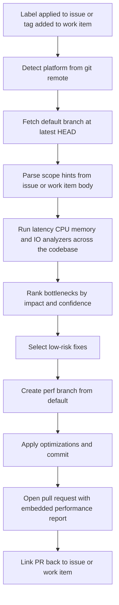

The **Performance Optimizer** performs a **whole-codebase** performance review against the repository's default branch and opens a pull request containing focused, low-risk optimizations together with an embedded performance report.

It is **issue-driven**: applying a single label to a GitHub issue (or tagging an Azure DevOps work item) launches the full flow — fetch default branch, analyze, fix, branch, PR, and link back to the originating issue.

Single trigger label: **`ai-dlc/perf/optimize`**

It focuses on:

| Capability | What it detects |
|---|---|
| **Latency Bottlenecks** | Slow request paths, expensive synchronous chains, high tail latency patterns |
| **CPU Hotspots** | Costly loops, repeated heavy computation, inefficient algorithms on critical paths |
| **Memory Pressure** | Excess allocations, retention-prone structures, avoidable object churn |
| **I/O and Query Inefficiencies** | N+1 queries, repeated remote calls, blocking I/O, missing batching/caching opportunities |

These capability categories follow common performance engineering practice; thresholds and prioritization are repository-specific and configurable.

Works with **GitHub** (issues) and **Azure DevOps** (work items). The underlying `/perf-optimize` command also runs locally against any git repository.

---

## How It Works



1. **Trigger detection** — webhook fires when `ai-dlc/perf/optimize` is applied to an issue (GitHub) or added as a tag on a work item (Azure DevOps).
2. **Detect platform** — reads `git remote` to confirm GitHub or Azure DevOps.
3. **Fetch default branch** — clones / checks out the latest commit on the repository's default branch. This is the analysis baseline, **not** a PR diff.
4. **Parse scope hints** — inspects the issue / work item body for optional `Scope:` and `Target:` hints; otherwise analyzes the whole codebase.
5. **Analyze bottlenecks** — evaluates latency, CPU, memory, and I/O patterns across the scoped paths.
6. **Prioritize impact** — ranks findings by expected performance gain, confidence, and blast radius.
7. **Apply scoped fixes** — commits selected low-risk optimizations to a new branch named `perf/issue-{number}-<slug>` (GitHub) or `perf/workitem-{id}-<slug>` (Azure DevOps).
8. **Open pull request** — PR title `perf: <issue title>`; PR body includes the full performance report and a `Closes #{number}` / work-item link reference.
9. **Link back** — posts a comment on the originating issue / work item pointing at the new PR.

This keeps the trigger lightweight (one label), moves review effort to the PR where teams already spend it, and still produces a human-readable report alongside actual code changes.

---

## Inputs

| Input | Source | Required | Description |
|---|---|---|---|
| Repository URL | Agent rule | Yes | The repository to analyze — provided by the Xianix Agent rule |
| Default branch | Repository metadata | Yes | Analysis baseline (auto-detected from the remote) |
| Issue number | GitHub webhook payload | Yes (GitHub) | The issue whose label triggered the run |
| Work item ID | Azure DevOps webhook payload | Yes (Azure DevOps) | The work item whose tag triggered the run |
| `ai-dlc/perf/optimize` | Issue label / work item tag | Yes | Single trigger for the full analyze-and-fix flow |
| Scope path | Issue / work item body | No | Restrict analysis to a directory or glob — e.g. `Scope: src/services` |
| Runtime target | Issue / work item body | No | Prioritize `api`, `worker`, `frontend`, or `data` — e.g. `Target: api` |

The platform is **auto-detected** from `git remote`. Scope hints are optional; if none are provided, the agent scans the whole codebase.

### Scope hint format

When creating a GitHub issue or Azure DevOps work item, you can add scope hints to the body to focus the analysis on a specific area or runtime. Any line that starts with `Scope:` or `Target:` is parsed as a hint; every other line is treated as plain context the agent reads but the parser ignores. Both hints are optional and independent — use whichever combination matches what you know.

**Typical — describe the problem and add hints:**

```text
Our /checkout and /orders endpoints feel slow under peak load.
Scope: src/api, src/services
Target: api
```

**Minimal — hints only, no prose:**

```text
Scope: src/services, src/workers
Target: api
```

**Partial — one hint only:**

```text
The dashboard feels janky when many widgets are mounted.
Target: frontend
```

`Scope:` accepts a single path or a comma-separated list, matched as globs relative to the repository root. `Target:` accepts `api`, `worker`, `frontend`, or `data`.

---

## Sample Prompts

The agent is primarily **webhook-driven** via issue labels. The `/perf-optimize` command can still be invoked locally when you run Claude Code directly.

**Scan the whole codebase on the default branch:**

```text
/perf-optimize
```

**Scan a specific directory:**

```text
/perf-optimize --scope src/services
```

**Scope to a runtime target:**

```text
/perf-optimize --target api
```

**Trigger via GitHub issue:** add the `ai-dlc/perf/optimize` label to the issue. The agent will:

1. Fetch the default branch at its latest commit.
2. Analyze the whole codebase (or the scope declared in the issue body).
3. Open a PR from `perf/issue-{N}-<slug>` containing focused optimizations and the performance report.
4. Comment on the issue linking to the new PR.

**Trigger via Azure DevOps work item:** add the `ai-dlc/perf/optimize` tag to the work item. The agent follows the same flow, creating a branch named `perf/workitem-{id}-<slug>` and a PR that references the work item.

---

## PR Output

Every run produces **one pull request** against the default branch. Its body contains:

- **Top bottlenecks** ranked by likely user impact
- **Latency risk areas** with estimated request-path effect
- **CPU and memory hotspots** with probable causes
- **I/O and query inefficiencies** with concrete rewrite suggestions
- **Optimization backlog** split into quick wins vs deeper follow-up
- **Per-change rationale** — why each commit matters, expected impact, validation hints
- **Traceability** — `Closes #{issue-number}` (GitHub) or work-item reference (Azure DevOps)

The agent only commits changes for findings it classifies as **low-risk quick wins**. Higher-risk or architectural suggestions are listed in the report's backlog section for human follow-up rather than auto-applied.

---

## Environment Variables

The Xianix Agent reads these from its secrets store and injects them at runtime via the rule's `with-envs` block (see the rule examples below). For local CLI use, export them in your shell.

| Variable | Platform | Required | Purpose |
|---|---|---|---|
| `GITHUB-TOKEN` | GitHub | Yes | Authenticate `gh` CLI for issue reads, branch push, PR creation, and comment publishing |
| `AZURE-DEVOPS-TOKEN` | Azure DevOps | Yes | PAT for REST API calls against work items, code, and pull requests |

### GitHub Token Permissions

The `GITHUB-TOKEN` requires:

| Permission | Access | Why it's needed |
|---|---|---|
| **Contents** | Read & Write | Read repository code, push the new `perf/issue-*` branch |
| **Metadata** | Read | Resolve repository metadata (default branch, etc.) |
| **Issues** | Read & Write | Read the trigger issue body / scope hints and post a link-back comment |
| **Pull requests** | Read & Write | Open the optimization PR and update it with the report |

### Azure DevOps PAT Scopes

The `AZURE-DEVOPS-TOKEN` requires:

| Scope | Access | Why it's needed |
|---|---|---|
| **Code** | Read, Write & Manage | Read repository code, push the new `perf/workitem-*` branch, and open the pull request |
| **Work Items** | Read & Write | Read the trigger work item body / scope hints and post a link-back comment |

---

## Quick Start

```bash
# Point Claude Code at the plugin
claude --plugin-dir /path/to/xianix-plugins-official/plugins/perf-optimizer

# Then in the chat
/perf-optimize
```

Or trigger it automatically via Xianix Agent rules by labeling a GitHub issue / tagging an Azure DevOps work item with `ai-dlc/perf/optimize`.

---

## Rule Examples

Use a single execution block per platform in your `rules.json`.

### Trigger behavior

The Performance Optimizer is **label-driven** with a single trigger:

| Platform | Matched webhook event | Filter rule |
|---|---|---|
| GitHub | `issues` `action==labeled` | `label.name=='ai-dlc/perf/optimize'` |
| Azure DevOps | `workitem.updated` | `resource.fields['System.Tags']` contains `ai-dlc/perf/optimize` |

### Execution-block shape

Each execution block in `rules.json` follows this top-level shape:

| Field | Purpose |
|---|---|
| `name` | Human-readable id for the execution |
| `platform` | `"github"` or `"azuredevops"` — drives which provider the plugin uses |
| `repository.url` | Webhook path to the repository URL (e.g. `repository.clone_url`). Omit the entire `repository` block for Azure DevOps **work items** — work items aren't bound to a single repo, so the URL must be supplied as a constant `use-inputs` entry instead (one rule per repo). |
| `repository.ref` | Webhook path to the branch ref (e.g. `repository.default_branch`). Used only when the trigger event carries one. |
| `match-any` | Array of trigger filters — first one to match wins |
| `use-inputs` | **Minimal** — usually just the entry-point id (e.g. `issue-number`, `workitem-id`). The plugin fetches the body / hints / metadata it needs from the platform API at runtime using the token in `with-envs`. |
| `use-plugins` | The plugin to invoke |
| `with-envs` | Required environment variables, sourced from the agent's `secrets.*` store and marked `mandatory: true` |
| `execute-prompt` | The prompt sent to the agent. Implicit interpolations: `{{repository-name}}` and `{{git-ref}}` from the `repository` block, plus any `name` from `use-inputs` |

### GitHub Rule

```json
{
  "name": "github-performance-optimizer",
  "platform": "github",
  "repository": {
    "url": "repository.clone_url",
    "ref": "repository.default_branch"
  },
  "match-any": [
    {
      "name": "github-issue-label-applied",
      "rule": "action==labeled&&label.name=='ai-dlc/perf/optimize'"
    }
  ],
  "use-inputs": [
    { "name": "issue-number", "value": "issue.number", "mandatory": true }
  ],
  "use-plugins": [
    {
      "plugin-name": "perf-optimizer@xianix-plugins-official",
      "marketplace": "xianix-team/plugins-official"
    }
  ],
  "with-envs": [
    { "name": "GITHUB-TOKEN", "value": "secrets.GITHUB-TOKEN", "mandatory": true }
  ],
  "execute-prompt": "Whole-codebase performance review triggered by issue #{{issue-number}} in {{repository-name}} on the {{git-ref}} branch.\n\nRun /perf-optimize {{issue-number}} — fetch the issue body, parse any `Scope:` / `Target:` hints, scan the selected scope (default: entire codebase), apply only low-risk optimizations on a new `perf/issue-{{issue-number}}-<slug>` branch, open a pull request against {{git-ref}} with the full performance report embedded and `Closes #{{issue-number}}`, then comment on issue #{{issue-number}} linking to the new PR."
}
```

### Azure DevOps Rule

Because work items are project-scoped (not repo-scoped), the target repository URL must be configured on the rule itself rather than read from the event payload. Deploy one rule per repository you want to cover — using a constant `use-inputs` entry for the repo URL.

```json
{
  "name": "azuredevops-performance-optimizer",
  "platform": "azuredevops",
  "match-any": [
    {
      "name": "azuredevops-workitem-tagged",
      "rule": "eventType==workitem.updated&&resource.revision.fields.\"System.Tags\"*='ai-dlc/perf/optimize'&&resource.fields.\"System.Tags\".oldValue!*='ai-dlc/perf/optimize'"
    }
  ],
  "use-inputs": [
    { "name": "workitem-id",     "value": "resource.workItemId", "mandatory": true },
    { "name": "repository-url",  "value": "https://dev.azure.com/<org>/<project>/_git/<repo>", "constant": true, "mandatory": true },
    { "name": "default-branch",  "value": "main", "constant": true }
  ],
  "use-plugins": [
    {
      "plugin-name": "perf-optimizer@xianix-plugins-official",
      "marketplace": "xianix-team/plugins-official"
    }
  ],
  "with-envs": [
    { "name": "AZURE-DEVOPS-TOKEN", "value": "secrets.AZURE-DEVOPS-TOKEN", "mandatory": true }
  ],
  "execute-prompt": "Whole-codebase performance review triggered by work item #{{workitem-id}}. Target repo: {{repository-url}} (branch: {{default-branch}}).\n\nRun /perf-optimize {{workitem-id}} — fetch the work item description, parse any `Scope:` / `Target:` hints, scan the selected scope (default: entire codebase), apply only low-risk optimizations on a new `perf/workitem-{{workitem-id}}-<slug>` branch, open a pull request against {{default-branch}} with the full performance report embedded and a reference to work item #{{workitem-id}}, then post a link-back comment on the work item."
}
```

:::note
Replace the `<org>`, `<project>`, and `<repo>` placeholders in the Azure DevOps rule with your actual values. Deploy one rule per repository you want to cover. The `repository-url` constant is what makes that per-repo deployment possible — without it, the plugin has no way to know which repo to clone from a project-scoped work item event.
:::

:::note
These blocks belong inside the `executions` array of a rule set. See [Rules Configuration](/agent-configuration/rules/) for full syntax.
:::

:::caution[Credentials]
The `with-envs` block is **required**, not cosmetic. The plugin's `validate-prerequisites.sh` hook refuses to run `git push` without a platform token in the container, and `"mandatory": true` makes the executor fail fast if the value isn't resolvable:

- `GITHUB-TOKEN` — resolved via `secrets.GITHUB-TOKEN` from the tenant Xians Secret Vault and injected into the container. Must hold a GitHub PAT with `repo` + `workflow` scopes (or an equivalent GitHub App token). Consumed by `gh` CLI and by `git push` over HTTPS to `github.com`.
- `AZURE-DEVOPS-TOKEN` — resolved via `secrets.AZURE-DEVOPS-TOKEN` from the tenant Xians Secret Vault. Must hold an Azure DevOps PAT with `Work Items: Read & Write` and `Code: Read, Write & Manage`. Consumed by `curl` REST calls and by `git push` to `dev.azure.com` / `visualstudio.com`.

With `mandatory: true` a missing vault entry fails the executor container at start time (non-retryable) with an error listing which variables were unresolved. Without it, runs would succeed through analysis, planning, and committing, then **block at the push step** with a hook error.
:::

---

## Safety Invariants

The Performance Optimizer guarantees — enforced by both the orchestrator prompt and the `hooks/validate-prerequisites.sh` PreToolUse hook — that:

- **The default branch is never pushed to.** All changes go on a new `perf/issue-*` or `perf/workitem-*` branch.
- **Only Quick-win findings are ever applied automatically.** Architectural rewrites are surfaced as _Deeper follow-up_ in the embedded report, never auto-applied.
- **Every optimization commit is scoped and documented.** One commit per finding, prefixed `perf:`, with file + line reference.
- **The PR body always embeds the full performance report** so reviewers see analysis and code side by side.

---

