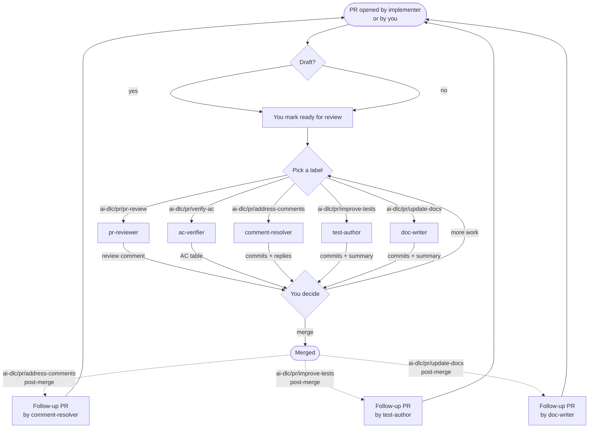
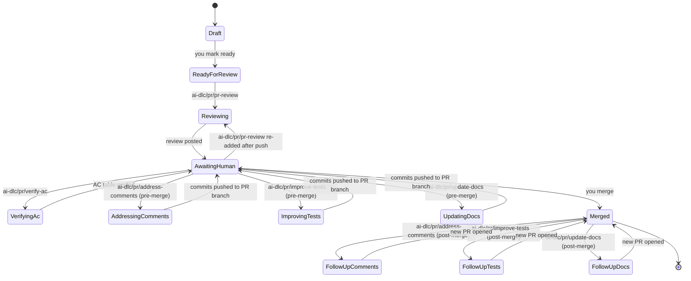
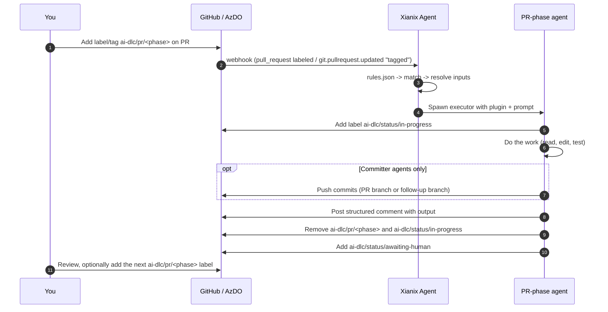

Once implementation reaches a pull request, the **PR-phase agents** can help. They share the same `ai-dlc/*` vocabulary used across the rest of AI-DLC, all under the dedicated `ai-dlc/pr/*` namespace, but every trigger, every commit, and every comment is scoped to a single PR.

This page is the deep dive on that phase: the overall flow, then a per-agent breakdown of what fires it, what it does, and what it produces — written so the same workflow works on **GitHub** and **Azure DevOps**. For most teams, this is the easiest place to start adopting AI-DLC because review support and tidy-up work fit naturally around an existing PR process.

:::tip[Same labels, different surfaces]
On GitHub the trigger is a **label** added to the PR. On Azure DevOps it's a **tag** added to the pull request (or, for repos that prefer it, a label on the linked work item). The agent rules normalise both into the same `ai-dlc/pr/*` vocabulary, so the workflow you see below is identical on either platform.
:::

:::note[Namespace recap]
PR-phase triggers all live under `ai-dlc/pr/*`. Status labels set by agents (`ai-dlc/status/in-progress`, `ai-dlc/status/awaiting-human`, `ai-dlc/status/blocked`) are shared with the rest of the lifecycle. See the [Marketplace Overview labels table](/official-plugins/overview/#the-shared-language-ai-dlc-labels) for the full list.
:::

---

## The PR-phase agents at a glance

| Agent | Trigger label / tag | Posts | Pushes commits |
|---|---|---|---|
| `pr-reviewer` | `ai-dlc/pr/pr-review` | Unified review comment | No |
| `ac-verifier` | `ai-dlc/pr/verify-ac` | Per-AC pass/fail/uncovered table | No |
| `comment-resolver` | `ai-dlc/pr/address-comments` | Reply on each thread + commits | Yes |
| `test-author` | `ai-dlc/pr/improve-tests` | Summary comment + commits | Yes |
| `doc-writer` | `ai-dlc/pr/update-docs` | Summary comment + commits | Yes |

The two **read-only** agents (`pr-reviewer`, `ac-verifier`) post comments only — they can be added freely (including in parallel) without branch contention. The three **committers** can be applied to a PR at **any point in its life**:

- **Before merge** → commits go to the **PR's own branch**. You can apply **one, several, or all** in parallel; each agent pushes its own commits.
- **After merge** → each agent cuts a **new branch from the merge commit**, pushes its commits there, and **opens a follow-up PR** that references the original. You'll get **one follow-up PR per agent**.

:::tip[Start with review support, then add tidy-up]
The lowest-friction rollout is usually `ai-dlc/pr/pr-review` first. Add `ai-dlc/pr/improve-tests`, `ai-dlc/pr/update-docs`, or `ai-dlc/pr/address-comments` later when the team wants help with repetitive clean-up that humans often postpone.
:::

:::note[Triggers fire on addition only]
Every rule in this page is scoped to the **moment a label or tag is added** — not to the PR having that label later on. On GitHub this is enforced by `action==labeled` plus a `label.name==…` match; on Azure DevOps it's enforced by `message.text` matching the "tagged the pull request" event plus a check on the new tag in `resource.labels`. As a result, an agent runs **exactly once** per label/tag application: re-running it means removing the label/tag and adding it again.
:::

---

## The overall workflow

Every arrow leaving an agent represents the agent **removing its trigger label**, **posting a structured comment** (and pushing commits, where applicable), and **adding `ai-dlc/status/awaiting-human`**. Every arrow leaving a human represents a single label/tag change.

:::note[Not every PR needs every agent]
Most teams will use only a subset of this flow on most pull requests. `pr-reviewer` is the most natural default; the committer agents are better treated as optional helpers for polish, maintenance, and post-merge catch-up.
:::

---

## State machine

The PR moves through these states by label transitions alone:

:::tip[Follow-up PRs are normal PRs]
A follow-up PR opened by `comment-resolver`, `test-author`, or `doc-writer` after merge is just a regular PR. It can itself be reviewed with `ai-dlc/pr/pr-review`, extended with `ai-dlc/pr/improve-tests` / `ai-dlc/pr/update-docs`, and merged like any other change.
:::

---

## Per-agent breakdown

Each agent below uses the same shape: **Triggers** (how it's invoked on each platform), **Activities** (what it does once invoked), and **Outputs** (what you'll find on the PR when it's done).

### `pr-reviewer`

A read-only, multi-dimensional review of the PR diff. Full plugin reference: [PR Reviewer](/official-plugins/pr-reviewer/).

This is the best default starting point for AI-DLC on a mature team because it adds signal without changing the branch.

#### Triggers

| Platform | Surface | What you do | Webhook event the rule matches |
|---|---|---|---|
| **GitHub** | Label on the PR | Add `ai-dlc/pr/pr-review` | `pull_request` where `action==labeled` **and** the just-added `label.name=='ai-dlc/pr/pr-review'` (the rule fires once per addition, not on every later PR update) |
| **GitHub** | Reviewer assignment *(default rule)* | Request `xianix-agent` as a reviewer | `pull_request` with `action==review_requested` and `requested_reviewer.login=='xianix-agent'` |
| **Azure DevOps** | Tag on the PR | Add `ai-dlc/pr/pr-review` | `git.pullrequest.updated` where `message.text` matches `tagged the pull request` **and** the new tag in `resource.labels` is `ai-dlc/pr/pr-review` (so the rule fires only on the tag-addition event, not on commits, comments, or reviewer updates) |
| **Azure DevOps** | Reviewer assignment *(default rule)* | Add `xianix-agent` as a reviewer | `git.pullrequest.updated` with `xianix-agent` in `resource.reviewers` and message contains `as a reviewer` |

See [PR Reviewer — Rule Examples](/official-plugins/pr-reviewer/#rule-examples) for the complete `match-any` blocks.

#### Activities

1. Detects platform from `git remote` (GitHub vs Azure DevOps).
2. Fetches the PR diff, commit log, and changed file list against the base branch.
3. Classifies the change (type, languages, risk, scope).
4. Runs **four reviewers in parallel**: code quality, security, test coverage, performance.
5. Compiles the findings into a single structured report.
6. Adds `ai-dlc/status/in-progress` while running, removes it on completion.

#### Outputs

- A **single unified review comment** posted on the PR, grouped by reviewer with severity tags and inline file references.
- For unsupported platforms only, a `pr-review-report.md` file written to the workspace.
- Removes `ai-dlc/pr/pr-review`, adds `ai-dlc/status/awaiting-human`.
- **No commits.** With the optional `--fix` flag (when invoked manually) the plugin will also apply fixes, commit, and push — the default lifecycle rule does **not** enable `--fix`.

---

### `ac-verifier`

Closes the loop between the [Requirement Analyst](/official-plugins/req-analyst/) phase and the PR. Cross-checks the PR diff against the Gherkin acceptance criteria written by `ac-writer` on the linked issue / work item.

This is most useful when the team has already invested in explicit acceptance criteria. It should be treated as a support tool for static verification, not as a replacement for human signoff or runtime validation.

#### Triggers

| Platform | Surface | What you do | Webhook event the rule matches |
|---|---|---|---|
| **GitHub** | Label on the PR | Add `ai-dlc/pr/verify-ac` | `pull_request` where `action==labeled` **and** the just-added `label.name=='ai-dlc/pr/verify-ac'` (fires once per addition, not on later PR updates) |
| **Azure DevOps** | Tag on the PR | Add `ai-dlc/pr/verify-ac` | `git.pullrequest.updated` where `message.text` matches `tagged the pull request` **and** the new tag in `resource.labels` is `ai-dlc/pr/verify-ac` |

The agent expects the PR description (or a linked issue / work item) to reference the ID where the AC lives — for example `Closes #42` on GitHub or `AB#42` on Azure DevOps.

#### Activities

1. Resolves the **linked issue / work item** from the PR body or commit trailers.
2. Reads the Gherkin acceptance criteria from that artifact.
3. Walks the PR diff and any related test files.
4. Classifies each scenario into one of:
   - **pass** — clearly satisfied by the diff.
   - **fail** — contradicted by the diff.
   - **uncovered** — no evidence either way (usually a missing test).
5. Adds `ai-dlc/status/in-progress` while running, removes it on completion.

#### Outputs

- A **per-AC table comment** on the PR with the status of every scenario and a short justification per row.
- A **suggested next step** at the bottom of the comment — typically `ai-dlc/pr/address-comments` to fix `fail` rows or `ai-dlc/pr/improve-tests` to cover `uncovered` rows.
- Removes `ai-dlc/pr/verify-ac`, adds `ai-dlc/status/awaiting-human`.
- **No commits.** This agent is strictly read-only.

---

### `comment-resolver`

Picks up unresolved review threads — from humans, `pr-reviewer`, or `ac-verifier` — and applies the actionable ones as commits.

Best used for clear, repetitive follow-up work after humans have already decided what should change. On contentious or fast-moving PRs, teams may prefer to use it after merge so the main review branch stays stable.

#### Triggers

| Platform | Surface | What you do | Webhook event the rule matches |
|---|---|---|---|
| **GitHub** | Label on the PR | Add `ai-dlc/pr/address-comments` | `pull_request` where `action==labeled` **and** the just-added `label.name=='ai-dlc/pr/address-comments'` (fires once per addition, not on later PR updates) |
| **Azure DevOps** | Tag on the PR | Add `ai-dlc/pr/address-comments` | `git.pullrequest.updated` where `message.text` matches `tagged the pull request` **and** the new tag in `resource.labels` is `ai-dlc/pr/address-comments` |

#### Activities

1. Lists every **unresolved** review thread on the PR (top-level and inline).
2. Classifies each comment into one of three buckets:
   - **apply** — clear, actionable change request.
   - **discuss** — needs human judgement; will be left open.
   - **decline** — out of scope, conflicts with another decision, or factually wrong.
3. For every **apply** comment, edits the relevant files.
4. Pushes commits and **resolves the threads** it acted on.
5. Replies to **discuss** and **decline** threads with a short justification, leaving them open.
6. Adds `ai-dlc/status/in-progress` while running, removes it on completion.

#### Outputs

| Where the PR is | What the agent does |
|---|---|
| **Open** (pre-merge) | Pushes commits to the **PR's source branch**; resolves the threads it addressed. |
| **Already merged** | Cuts a new branch from the merge commit (e.g. `ai-dlc/pr/address-comments/<n>`), pushes the changes, and **opens a follow-up PR** linked back to the original. |

- A **summary comment** on the PR listing each comment and its disposition (apply / discuss / decline).
- Removes `ai-dlc/pr/address-comments`, adds `ai-dlc/status/awaiting-human`.

---

### `test-author`

Strengthens the test suite for a PR — fills coverage gaps, adds edge cases, refines flaky or weak assertions. Baseline tests from implementation (including TDD) are assumed; this step is about **improvement**, not greenfield test authorship.

This is a strong fit for boring but valuable engineering work: hardening tests after the main code path is already understood.

#### Triggers

| Platform | Surface | What you do | Webhook event the rule matches |
|---|---|---|---|
| **GitHub** | Label on the PR | Add `ai-dlc/pr/improve-tests` | `pull_request` where `action==labeled` **and** the just-added `label.name=='ai-dlc/pr/improve-tests'` (fires once per addition, not on later PR updates) |
| **Azure DevOps** | Tag on the PR | Add `ai-dlc/pr/improve-tests` | `git.pullrequest.updated` where `message.text` matches `tagged the pull request` **and** the new tag in `resource.labels` is `ai-dlc/pr/improve-tests` |

May be applied **at the same time** as `ai-dlc/pr/update-docs` — the two agents run in parallel and each pushes its own commits.

#### Activities

1. Reads the PR diff and the existing test files for the changed modules.
2. Identifies **uncovered branches**, **missing edge cases**, and **weak assertions**.
3. Writes new tests (or strengthens existing ones) in the project's existing testing style and framework.
4. Runs the test suite locally inside its sandbox to confirm everything still passes.
5. Adds `ai-dlc/status/in-progress` while running, removes it on completion.

#### Outputs

| Where the PR is | What the agent does |
|---|---|
| **Open** (pre-merge) | Pushes test commits to the **PR's source branch**. |
| **Already merged** | Cuts a new branch from the merge commit (e.g. `ai-dlc/pr/improve-tests/<n>`), pushes the test improvements, and **opens a follow-up PR** linked back to the original. |

- A **summary comment** on the PR listing the files touched, the new tests added, and any coverage delta the agent could measure.
- Removes `ai-dlc/pr/improve-tests`, adds `ai-dlc/status/awaiting-human`.

---

### `doc-writer`

Updates user-facing and internal documentation (`Docs/`, READMEs, inline doc comments) so the docs ship with the code.

This is another strong fit for boring but important follow-up work, especially when teams routinely merge changes before docs catch up.

#### Triggers

| Platform | Surface | What you do | Webhook event the rule matches |
|---|---|---|---|
| **GitHub** | Label on the PR | Add `ai-dlc/pr/update-docs` | `pull_request` where `action==labeled` **and** the just-added `label.name=='ai-dlc/pr/update-docs'` (fires once per addition, not on later PR updates) |
| **Azure DevOps** | Tag on the PR | Add `ai-dlc/pr/update-docs` | `git.pullrequest.updated` where `message.text` matches `tagged the pull request` **and** the new tag in `resource.labels` is `ai-dlc/pr/update-docs` |

May be applied **at the same time** as `ai-dlc/pr/improve-tests`. The two agents commit independently — resolve any push races the same way you would for two human contributors.

#### Activities

1. Reads the PR diff and locates the documentation that mentions the changed surfaces.
2. Cross-references READMEs, the `Docs/` tree, and any in-code doc comments.
3. Drafts updates in the project's existing documentation style (tone, formatting, frontmatter).
4. Adds `ai-dlc/status/in-progress` while running, removes it on completion.

#### Outputs

| Where the PR is | What the agent does |
|---|---|
| **Open** (pre-merge) | Pushes doc commits to the **PR's source branch** so code and docs stay reviewable together. |
| **Already merged** | Cuts a new branch from the merge commit (e.g. `ai-dlc/pr/update-docs/<n>`), pushes the doc updates, and **opens a follow-up PR** linked back to the original. |

- A **summary comment** on the PR listing the doc files touched and a one-line rationale per file.
- Removes `ai-dlc/pr/update-docs`, adds `ai-dlc/status/awaiting-human`.

---

## Combining agents on a single PR

The PR-phase agents are designed to compose. Some common combinations:

| Goal | Labels to apply | Order |
|---|---|---|
| Standard review pass | `ai-dlc/pr/pr-review` | One at a time |
| Review + verify against AC | `ai-dlc/pr/pr-review`, `ai-dlc/pr/verify-ac` | In parallel — both read-only |
| Apply review feedback | `ai-dlc/pr/address-comments` | After review is posted |
| Ship a feature with full hygiene | `ai-dlc/pr/improve-tests` + `ai-dlc/pr/update-docs` | In parallel before merge |
| Forgot something — patch post-merge | Any of `ai-dlc/pr/address-comments`, `ai-dlc/pr/improve-tests`, `ai-dlc/pr/update-docs` | Each opens its own follow-up PR |

:::caution[One PR, one branch]
When multiple committer agents run on the **same open PR in parallel**, they push to the same branch. Both push cleanly in the common case, but if both edit the same hunk you'll see a normal git conflict — resolve it the same way you would between two human teammates. On fast-moving branches, many teams will find it smoother to run one committer at a time or prefer post-merge follow-up PRs.
:::

---

## Webhook contract

Under the hood every PR-phase trigger uses the same agent contract as the rest of the lifecycle:

For the platform-specific rule blocks (the exact `match-any` filters and `use-inputs` mappings) see:

- [PR Reviewer — Rule Examples](/official-plugins/pr-reviewer/#rule-examples) for `pr-reviewer` on both platforms.
- [Rules Configuration](/agent-configuration/rules/) for the full filter syntax used by every agent in the team.

---

## See also

- [Adoption Guide](/official-plugins/adoption-guide/) — the recommended low-friction rollout path for human-led teams.
- [Marketplace Overview](/official-plugins/overview/) — the shared label vocabulary, contracts, scanners, and install path.
- [Issue Lifecycle](/official-plugins/issue-lifecycle/) — the deep dive on what happens before `implementer` opens a draft PR.
- [PR Reviewer](/official-plugins/pr-reviewer/) — the deep dive on `pr-reviewer`.
- [Requirement Analyst](/official-plugins/req-analyst/) — the deep dive on `req-analyst` (whose AC powers `ac-verifier`).
- [GitHub Setup](/agent-configuration/github/) and [Azure DevOps Setup](/agent-configuration/azure-devops/) — getting the webhooks wired up.
