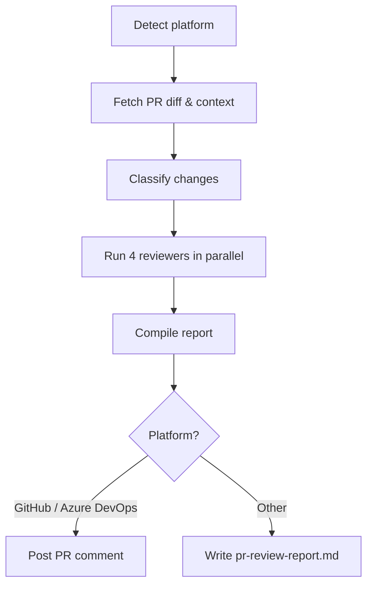

The **PR Reviewer** plugin runs four specialized reviewers in parallel and posts a unified, structured review directly on your pull request.

| Reviewer | What it looks for |
|---|---|
| **Code Quality** | Architecture, patterns, readability, maintainability |
| **Security** | Vulnerabilities, exposed secrets, insecure patterns (OWASP) |
| **Test Coverage** | Missing tests, quality gaps, untested code paths |
| **Performance** | Bottlenecks, algorithmic issues, resource waste |

Works with **GitHub**, **Azure DevOps**, **Bitbucket**, and any generic git repository.

---

## How It Works


```mermaid
flowchart TD
    A[Detect platform] --> B[Fetch PR diff & context]
    B --> C[Classify changes]
    C --> D[Run 4 reviewers in parallel]
    D --> E[Compile report]
    E --> F{Platform?}
    F -->|GitHub / Azure DevOps| G[Post PR comment]
    F -->|Other| H[Write pr-review-report.md]
```

1. **Detect platform** — reads `git remote` to identify GitHub, Azure DevOps, Bitbucket, or generic.
2. **Fetch PR context** — gathers the diff, commit log, and changed file list against the base branch.
3. **Classify changes** — determines change type, languages involved, risk level, and scope.
4. **Parallel review** — code-quality, security, test, and performance reviewers run simultaneously.
5. **Compile & post** — findings are merged into a single report and posted as a PR comment (or saved to `pr-review-report.md` for unsupported platforms).

With the `--fix` flag the plugin will also apply fixes, commit, and push.

---

## Inputs

| Input | Source | Required | Description |
|---|---|---|---|
| Repository URL | Agent rule | Yes | The repository to review — provided by the Xianix Agent rule, not typed in the prompt |
| PR number | Prompt | No | Target a specific pull request (e.g. `123`) |
| Branch name | Prompt | No | Compare a branch against the default base |
| `--fix` flag | Prompt | No | Auto-fix issues, commit, and push |

The platform (GitHub, Azure DevOps, etc.) is **auto-detected** from `git remote` — you don't need to specify it.

---

## Sample Prompts

**Review the current branch:**

```text
/pr-review
```

**Review a specific PR:**

```text
/pr-review 42
```

**Review and auto-fix:**

```text
/pr-review 42 --fix
```

---

## Environment Variables

The Xianix Agent reads these from its secrets store and injects them at runtime via the rule's `with-envs` block (see the rule examples below). For local CLI use, export them in your shell.

| Variable | Platform | Required | Purpose |
|---|---|---|---|
| `GITHUB-TOKEN` | GitHub | Yes | Authenticate `gh` CLI for fetching PR data and posting comments |
| `AZURE-DEVOPS-TOKEN` | Azure DevOps | Yes | PAT for REST API calls and git push |

### GitHub Token Permissions

The `GITHUB-TOKEN` requires the following repository permissions:

| Permission | Access | Why it's needed |
|---|---|---|
| **Contents** | Read | Access repository contents, commits, branches, downloads, releases, and merges |
| **Metadata** | Read | Search repositories, list collaborators, and access repository metadata |
| **Pull requests** | Read & Write | Fetch pull request diffs and context, post review comments, and access related assignees, labels, milestones, and merges |

### Azure DevOps Token Permissions

The `AZURE-DEVOPS-TOKEN` (Personal Access Token) requires:

| Permission | Access | Why it's needed |
|---|---|---|
| **Code** | Read & Write | Fetch PR diffs and metadata, push fix commits when `--fix` is used |
| **Pull Request Threads** | Read & Write | Post and edit the review comment / threads on the PR |

---

## Quick Start

```bash
# Point Claude Code at the plugin
claude --plugin-dir /path/to/xianix-plugins-official/plugins/pr-reviewer

# Then in the chat
/pr-review
```

Or trigger it automatically via the Xianix Agent by adding a rule — see the examples below and the [Rules Configuration](/agent-configuration/rules/) guide.

---

## Rule Examples

Add one (or both) of the execution blocks below to your `rules.json` so the Xianix Agent automatically reviews pull requests when a webhook fires.

### When does the agent trigger?

The PR Reviewer is mainly **tag-driven**. It runs when the `ai-dlc/pr/pr-review` label (GitHub) or tag (Azure DevOps) is present on a pull request and one of the scenarios below fires (OR logic across `match-any` entries). On Azure DevOps there is also a **reviewer-assignment** trigger so you can request a review by adding `xianix-agent@99x.io` as a PR reviewer instead of tagging.

| Scenario | What it covers |
|---|---|
| PR opened / created with the tag already present | A PR is opened with the tag included from the start |
| New commits pushed to a tagged PR | The PR source branch is updated while the tag is still on the PR |
| Tag newly applied to a PR (GitHub only) | A human (or another rule) adds `ai-dlc/pr/pr-review` to an open PR |
| Agent added as a reviewer (Azure DevOps only) | `xianix-agent@99x.io` is added to the PR's reviewer list |

| Platform | Scenario | Webhook event | Filter rule |
|---|---|---|---|
| GitHub | Tag newly applied | `pull_request` | `action==labeled` and `label.name=='ai-dlc/pr/pr-review'` |
| GitHub | PR opened with tag | `pull_request` | `action==opened` and `ai-dlc/pr/pr-review` is in `pull_request.labels` |
| GitHub | New commits to tagged PR | `pull_request` | `action==synchronize` and `ai-dlc/pr/pr-review` is in `pull_request.labels` |
| Azure DevOps | PR created with tag | `git.pullrequest.created` | `ai-dlc/pr/pr-review` is in `resource.labels` |
| Azure DevOps | New commits to tagged PR | `git.pullrequest.updated` | `ai-dlc/pr/pr-review` is in `resource.labels` and `message.text` contains `updated the source branch` |
| Azure DevOps | Agent added as reviewer | `git.pullrequest.updated` | `message.text` contains `changed the reviewer list` and `xianix-agent@99x.io` is in `resource.reviewers` |

### Execution-block shape

Each execution block in `rules.json` follows this top-level shape:

| Field | Purpose |
|---|---|
| `name` | Human-readable id for the execution |
| `platform` | `"github"` or `"azuredevops"` — drives which provider the plugin uses |
| `repository.url` | Webhook path to the repository URL (e.g. `repository.clone_url`, `resource.repository.remoteUrl`) |
| `repository.ref` | Webhook path to the branch ref (e.g. `pull_request.head.ref`, `resource.sourceRefName`) |
| `match-any` | Array of trigger filters — first one to match wins |
| `use-inputs` | **Minimal** — usually just the entry-point id (e.g. `pr-link`, `pr-number`). The repository URL and ref are injected automatically from the `repository` block. |
| `use-plugins` | The plugin to invoke |
| `with-envs` | Required environment variables, sourced from the agent's `secrets.*` store and marked `mandatory: true` |
| `execute-prompt` | The prompt sent to the agent. Implicit interpolations: `{{repository-name}}` and `{{git-ref}}` from the `repository` block, plus any `name` from `use-inputs` |

### GitHub

```json
{
  "name": "github-pull-request-review",
  "platform": "github",
  "repository": {
    "url": "repository.clone_url",
    "ref": "pull_request.head.ref"
  },
  "match-any": [
    {
      "name": "github-pr-tag-applied",
      "rule": "action==labeled&&label.name=='ai-dlc/pr/pr-review'"
    },
    {
      "name": "github-pr-opened-with-tag",
      "rule": "action==opened&&pull_request.labels.*.name=='ai-dlc/pr/pr-review'"
    },
    {
      "name": "github-pr-synchronize-with-tag",
      "rule": "action==synchronize&&pull_request.labels.*.name=='ai-dlc/pr/pr-review'"
    }
  ],
  "use-inputs": [
    { "name": "pr-link", "value": "pull_request.url" }
  ],
  "use-plugins": [
    {
      "plugin-name": "pr-reviewer@xianix-plugins-official",
      "marketplace": "xianix-team/plugins-official"
    }
  ],
  "with-envs": [
    { "name": "GITHUB-TOKEN", "value": "secrets.GITHUB-TOKEN", "mandatory": true }
  ],
  "execute-prompt": "You are reviewing pull request {{pr-link}}. Run /pr-review to perform the automated review."
}
```

### Azure DevOps

```json
{
  "name": "azuredevops-pull-request-review",
  "platform": "azuredevops",
  "repository": {
    "url": "resource.repository.remoteUrl",
    "ref": "resource.sourceRefName"
  },
  "match-any": [
    {
      "name": "azuredevops-pr-created-with-tag",
      "rule": "eventType==git.pullrequest.created&&resource.labels.*.name=='ai-dlc/pr/pr-review'"
    },
    {
      "name": "azuredevops-pr-source-branch-updated-with-tag",
      "rule": "eventType==git.pullrequest.updated&&resource.labels.*.name=='ai-dlc/pr/pr-review'&&message.text*='updated the source branch'"
    },
    {
      "name": "azuredevops-pr-agent-added-as-reviewer",
      "rule": "eventType==git.pullrequest.updated&&message.text*='changed the reviewer list'&&resource.reviewers.*.uniqueName=='xianix-agent@99x.io'"
    }
  ],
  "use-inputs": [
    { "name": "pr-number", "value": "resource.pullRequestId" }
  ],
  "use-plugins": [
    {
      "plugin-name": "pr-reviewer@xianix-plugins-official",
      "marketplace": "xianix-team/plugins-official"
    }
  ],
  "with-envs": [
    { "name": "AZURE-DEVOPS-TOKEN", "value": "secrets.AZURE-DEVOPS-TOKEN", "mandatory": true }
  ],
  "execute-prompt": "You are reviewing pull request #{{pr-number}} in the repository {{repository-name}} (branch: {{git-ref}}).\n\nRun /pr-review to perform the automated review."
}
```

:::note
These blocks go inside the `executions` array of a rule set. See [Rules Configuration](/agent-configuration/rules/) for the full file structure and filter syntax.
:::
