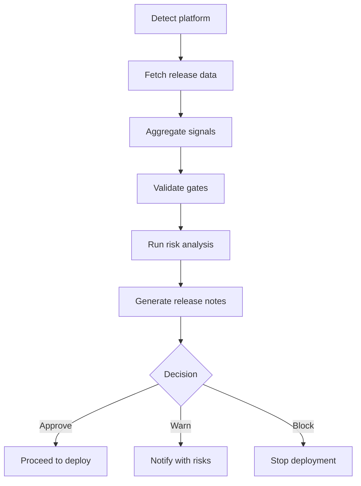

The **Release Manager** plugin acts as an intelligent deployment gatekeeper. It compiles release notes, validates quality gates, analyzes risks, and provides a clear go/no-go recommendation before production deployment.

It combines signals from CI/CD pipelines, code changes, test results, and runtime telemetry to ensure safe and reliable releases.

Works with **GitHub**, **Azure DevOps**, **Bitbucket**, and any generic CI/CD pipeline.

---

## What It Does

| Capability | Description |
|---|---|
| **Release Notes** | Generates structured, business-friendly release summaries |
| **Gate Validation** | Verifies build, test, quality, and security requirements |
| **Risk Analysis** | Identifies high-risk changes using historical and contextual signals |
| **Deployment Decision** | Approves, warns, or blocks releases |
| **Observability Check** | Analyzes staging logs, errors, and performance trends |

---

## How It Works



1. **Detect platform** — reads `git remote` to identify GitHub, Azure DevOps, Bitbucket, or generic.
2. **Fetch release data** — collects commits, PRs, pipeline results, and test reports.
3. **Aggregate signals** — combines code, test, security, and runtime data.
4. **Validate gates** — checks predefined quality and compliance rules.
5. **Risk analysis** — evaluates impact using change patterns and historical data.
6. **Generate notes** — creates structured release summaries.
7. **Decision output** — approves, warns, or blocks deployment.

---

## Inputs

| Input | Source | Required | Description |
|---|---|---|---|
| Repository URL | Agent rule | Yes | The repository being released — provided by the Xianix Agent rule, not typed in the prompt |
| Release version | Prompt / pipeline | Yes | Version/tag for the release |
| Environment | Prompt / pipeline | Yes | Target environment (e.g. `staging`, `prod`) |
| Pipeline ID | CI/CD | No | Specific pipeline run reference |

The platform (GitHub, Azure DevOps, etc.) is **auto-detected** from `git remote` — you don't need to specify it.

---

## Sample Prompts

**Evaluate the latest release:**

```text
/release-check
```

**Evaluate a specific version:**

```text
/release-check v1.4.2
```

**Generate release notes only:**

```text
/release-notes v1.4.2
```

---

## Output Example

### Release Status: ⚠️ Proceed with Caution

**Summary**
- 2 new features, 3 bug fixes
- Changes in critical processing module

**Risks Identified**
- High-risk module modified
- No new integration tests

**Gate Status**
- Build: Passed
- Test Coverage: Below threshold
- Security: No critical issues

**Recommendations**
- Run regression tests
- Monitor logs post-deployment

---

## Gate Rules (Examples)

| Rule | Action |
|---|---|
| Test coverage < 70% | Warn |
| Critical vulnerability detected | Block |
| Failed pipeline | Block |
| High-risk module changed without tests | Warn |

---

## Environment Variables

The Xianix Agent reads these from its secrets store and injects them at runtime via the rule's `with-envs` block (see the rule examples below). For local CLI use, export them in your shell.

| Variable | Platform | Required | Purpose |
|---|---|---|---|
| `GITHUB-TOKEN` | GitHub | Yes | Access releases, PRs, and pipeline status |
| `AZURE-DEVOPS-TOKEN` | Azure DevOps | Yes | Access pipelines, work items, and release data |
| `OBSERVABILITY-API-KEY` | Monitoring | No | Fetch logs and metrics from staging |

### GitHub Token Permissions

The `GITHUB-TOKEN` requires the following repository permissions:

| Permission | Access | Why it's needed |
|---|---|---|
| **Contents** | Read | Access repository contents, commits, branches, and releases |
| **Metadata** | Read | Search repositories and access repository metadata |
| **Pull requests** | Read | Fetch PRs included in the release |
| **Actions** | Read | Access CI pipeline run results and status |
| **Checks** | Read | Read check-run status for gate validation |

### Azure DevOps Token Permissions

The `AZURE-DEVOPS-TOKEN` (Personal Access Token) requires:

| Permission | Access | Why it's needed |
|---|---|---|
| **Code** | Read | Access repository contents, commits, and tags |
| **Build** | Read | Read pipeline run results and status |
| **Release** | Read | Read release pipeline state and deployment metadata |
| **Work Items** | Read | Fetch work items included in the release |

---

## Quick Start

```bash
# Point Claude Code at the plugin
claude --plugin-dir /path/to/xianix-plugins-official/plugins/release-manager

# Then in the chat
/release-check
```

Or trigger it automatically via the Xianix Agent by adding a rule — see the examples below and the [Rules Configuration](/agent-configuration/rules/) guide.

---

## Rule Examples

Add one (or both) of the execution blocks below to your `rules.json` so the Xianix Agent automatically validates releases when a webhook fires.

### When does the agent trigger?

The Release Manager is **event-driven**. It runs when the `ai-dlc/release/check` label (GitHub) or tag (Azure DevOps) is applied, or when a release is published directly. The OR logic across `match-any` entries means multiple scenarios can trigger the same validation run.

| Scenario | What it covers |
|---|---|
| Release published | A new release or tag is published on the repository |
| Label applied to a PR | A human applies `ai-dlc/release/check` to the last PR before releasing |
| Azure DevOps deployment started | A release pipeline deployment begins in Azure DevOps |

| Platform | Scenario | Webhook event | Filter rule |
|---|---|---|---|
| GitHub | Release published | `release` | `action==published` |
| GitHub | Label applied to PR | `pull_request` | `action==labeled` and `label.name=='ai-dlc/release/check'` |
| Azure DevOps | Deployment started | `ms.vss-release.deployment-started-event` | `resource.environment.name` is present |

### Execution-block shape

Each execution block in `rules.json` follows this top-level shape:

| Field | Purpose |
|---|---|
| `name` | Human-readable id for the execution |
| `platform` | `"github"` or `"azuredevops"` — drives which provider the plugin uses |
| `repository.url` | Webhook path to the repository URL (e.g. `repository.clone_url`). Omit for Azure DevOps **release-pipeline** events — those are project-scoped, not repo-scoped. |
| `repository.ref` | Webhook path to the branch ref (e.g. `release.target_commitish`). Optional. |
| `match-any` | Array of trigger filters — first one to match wins |
| `use-inputs` | **Minimal** — usually just the entry-point id (e.g. `release-version`). The plugin fetches release notes, PRs, and pipeline state from the platform API at runtime. |
| `use-plugins` | The plugin to invoke |
| `with-envs` | Required environment variables, sourced from the agent's `secrets.*` store and marked `mandatory: true` |
| `execute-prompt` | The prompt sent to the agent. Implicit interpolations: `{{repository-name}}` and `{{git-ref}}` from the `repository` block, plus any `name` from `use-inputs` |

### GitHub

```json
{
  "name": "github-release-check",
  "platform": "github",
  "repository": {
    "url": "repository.clone_url",
    "ref": "release.target_commitish"
  },
  "match-any": [
    {
      "name": "github-release-published",
      "rule": "action==published"
    }
  ],
  "use-inputs": [
    { "name": "release-version", "value": "release.tag_name", "mandatory": true }
  ],
  "use-plugins": [
    {
      "plugin-name": "release-manager@xianix-plugins-official",
      "marketplace": "xianix-team/plugins-official"
    }
  ],
  "with-envs": [
    { "name": "GITHUB-TOKEN", "value": "secrets.GITHUB-TOKEN", "mandatory": true }
  ],
  "execute-prompt": "Release {{release-version}} has been published in {{repository-name}} from branch {{git-ref}}.\n\nRun /release-check {{release-version}} to perform the automated release validation."
}
```

:::tip[Triggering on PR labels too?]
The previous version of this rule combined `release.published` and `pull_request.labeled` triggers in a single block. With the new minimal-input format these no longer share a common entry-point id, so the cleaner pattern is **one rule per trigger source**. If you also want a label-applied trigger, deploy a second rule that filters on `action==labeled&&label.name=='ai-dlc/release/check'` and uses `pull_request.head.ref` (or a constant) for the version.
:::

### Azure DevOps

Release-pipeline events are project-scoped, not repo-scoped, so the `repository` block is omitted. The plugin reads pipeline / release artifact metadata at runtime via the Azure DevOps REST API.

```json
{
  "name": "azuredevops-release-check",
  "platform": "azuredevops",
  "match-any": [
    {
      "name": "ado-deployment-started",
      "rule": "eventType==ms.vss-release.deployment-started-event"
    }
  ],
  "use-inputs": [
    { "name": "release-id", "value": "resource.release.id", "mandatory": true }
  ],
  "use-plugins": [
    {
      "plugin-name": "release-manager@xianix-plugins-official",
      "marketplace": "xianix-team/plugins-official"
    }
  ],
  "with-envs": [
    { "name": "AZURE-DEVOPS-TOKEN", "value": "secrets.AZURE-DEVOPS-TOKEN", "mandatory": true }
  ],
  "execute-prompt": "Azure DevOps release deployment started — release id {{release-id}}.\n\nRun /release-check {{release-id}} to perform the automated release validation. Resolve the release name, target environment, and repository from the release id via the `az` CLI."
}
```

:::note
These blocks go inside the `executions` array of a rule set. See [Rules Configuration](/agent-configuration/rules/) for the full file structure and filter syntax.
:::

---

## Advanced Capabilities

- Predict release failure probability
- Recommend rollback strategies
- Suggest optimal deployment windows
- Learn from past incidents

---

## Notes

:::note[Decision support, not automation]
The Release Manager is not just a report generator — it is a decision-support system. Keep humans in the loop for the final deployment approval.
:::

:::tip[Pair with PR Reviewer and CI/CD pipelines]
Best used together with [PR Reviewer](./pr-reviewer) and your CI/CD pipelines. The Release Manager aggregates the signals those tools produce into a single go/no-go recommendation, completing the AI-DLC loop from issue to deployment.
:::  

