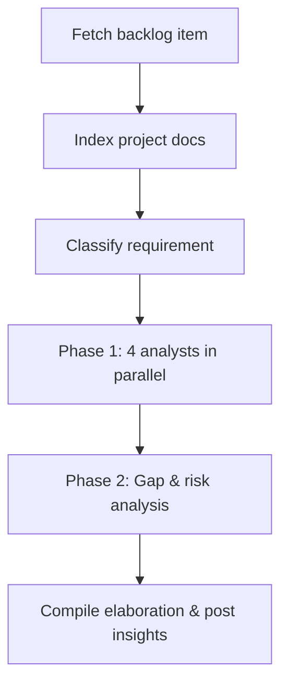

The **Requirement Analyst** plugin acts as a thinking partner for product owners, BAs, and engineers. Instead of judging whether a backlog item is "ready," it surrounds the item with the **context a senior analyst would bring to a refinement session** — relevant domain knowledge, how comparable products solve the same problem, the user journeys that touch this change, the personas affected, and the usability and adoption questions worth answering before any code is written.

It works with **GitHub Issues**, **Azure DevOps Work Items**, or plain text input.

---

## What You Get Back

Each run produces a structured elaboration posted directly on the backlog item. The goal is to **expand your thinking**, not to gate the work:

- **Fit with existing requirements** — if the repository contains other requirement documents (PRDs, specs, RFCs, ADRs, feature briefs, user stories), the plugin reads them and reasons about how the new ask fits the existing product context: overlaps, dependencies, contradictions, and gaps. This is a product-level analysis, not a code-level one.
- **Domain perspective** — concepts, terminology, regulations, and patterns from the relevant industry or problem space.
- **Competitive & market context** — how established products, open-source alternatives, or competitors typically approach this problem, and what users have come to expect.
- **User journeys** — the end-to-end flows the change participates in, including upstream triggers and downstream consequences.
- **Persona impact** — who is affected, how their goals differ, and where friction is most likely to appear.
- **Usability considerations** — accessibility, discoverability, error states, empty states, edge cases, and "what happens when…" questions.
- **Adoption considerations** — onboarding, migration, change management, documentation needs, and signals that would tell you the feature is actually being used.
- **Open questions & gaps** — assumptions worth validating and acceptance criteria worth tightening, framed as prompts for the team rather than blockers.

A lightweight readiness signal (`GROOMED`, `NEEDS CLARIFICATION`, or `NEEDS DECOMPOSITION`) is also applied as a label, but it's a hint for triage — the real value is in the elaboration itself.

---

## How It Works



1. **Fetch item** — pulls the issue/work-item from GitHub (`gh`) or Azure DevOps (REST API).
2. **Index project context** — scans READMEs, manifests, and any requirement documents in the repo (PRDs, specs, RFCs, ADRs, feature briefs, user stories under `/docs`, `/specs`, `/requirements`, etc.) to build a ~500-word project summary and a map of existing requirements. The new item is then reasoned about *against* that map — how it complements, extends, conflicts with, or duplicates what is already specified — at the product/requirements level, not the code level.
3. **Classify** — determines type (story / task / bug / spike), domain, and complexity to tune the depth of analysis.
4. **Phase 1 (parallel)** — four analysts contribute different lenses simultaneously:
   - **Intent** — surfaces the underlying user need and the "why" behind the ask.
   - **Domain** — brings in relevant domain knowledge, industry conventions, and how competitors or comparable products handle the same problem.
   - **Journey** — maps the user workflow around this requirement, including usability touchpoints and friction risks.
   - **Persona** — identifies affected user personas and adoption considerations specific to each.
5. **Phase 2** — a **Gap & Risk** analyst reviews Phase 1 output to surface missing acceptance criteria, edge cases, and risks as discussion prompts.
6. **Compile & post** — findings are formatted and posted as ordered comments on the issue, ready for the team to react to in the next refinement.

For unsupported platforms, the output is written to `requirement-elaboration-report.md`.

---

## Inputs

| Input | Source | Required | Description |
|---|---|---|---|
| Repository URL | Agent rule | Yes | The repository containing the backlog item — provided by the Xianix Agent rule, not typed in the prompt |
| Issue / Work-item number | Prompt | Yes | The backlog item to analyze (e.g. `42`) |

The platform (GitHub, Azure DevOps, etc.) is **auto-detected** from `git remote` — you don't need to specify it.

---

## Sample Prompt

```text
/requirement-analysis 42
```

---

## Environment Variables

| Variable | Platform | Required | Purpose |
|---|---|---|---|
| `GITHUB_TOKEN` | GitHub | Yes | Authenticate `gh` CLI for reading issues and posting comments |
| `AZURE_DEVOPS_TOKEN` | Azure DevOps | Yes | PAT for REST API calls (read work items, post comments) |

:::tip
For CI pipelines, you can also set `PLATFORM`, `REPO_URL`, and `ISSUE_NUMBER` to drive the plugin without interactive input.
:::

---

## Quick Start

```bash
# Point Claude Code at the plugin
claude --plugin-dir /path/to/xianix-plugins-official/plugins/req-analyst

# Then in the chat
/requirement-analysis 42
```

Or trigger it automatically via the Xianix Agent by adding a rule — see the examples below and the [Rules Configuration](/agent-configuration/rules/) guide.

---

## Rule Examples

Add one (or both) of the execution blocks below to your `rules.json` so the Xianix Agent automatically grooms backlog items when a webhook fires.

### When does the agent trigger?

The Requirement Analyst is **tag-driven**. It runs when the `ai-dlc/issue/analyze` label (GitHub) or tag (Azure DevOps) is present on an issue / work item and one of the following happens (OR logic across `match-any` entries):

| Scenario | What it covers |
|---|---|
| Tag newly applied | A human (or another rule) adds `ai-dlc/issue/analyze` to an existing issue or work item |
| Issue / work item created with the tag already present | The item is opened with the tag included from the start |

There is no longer any assignee-based trigger. The label or tag is the single source of truth for "analyze this backlog item."

| Platform | Scenario | Webhook event | Filter rule |
|---|---|---|---|
| GitHub | Tag newly applied | `issues` | `action==labeled` and the just-added `label.name=='ai-dlc/issue/analyze'` |
| GitHub | Issue opened with tag | `issues` | `action==opened` and `ai-dlc/issue/analyze` is in `issue.labels` |
| Azure DevOps | Tag newly applied | `workitem.updated` | `ai-dlc/issue/analyze` appears in the new `resource.revision.fields["System.Tags"]` value but not in `resource.fields["System.Tags"].oldValue` |
| Azure DevOps | Work item created with tag | `workitem.created` | `ai-dlc/issue/analyze` is in `resource.fields["System.Tags"]` |

### GitHub

```json
{
  "name": "github-issue-requirement-analysis",
  "match-any": [
    {
      "name": "github-issue-tag-applied",
      "rule": "action==labeled&&label.name=='ai-dlc/issue/analyze'"
    },
    {
      "name": "github-issue-opened-with-tag",
      "rule": "action==opened&&issue.labels.*.name=='ai-dlc/issue/analyze'"
    }
  ],
  "use-inputs": [
    { "name": "issue-number",    "value": "issue.number" },
    { "name": "repository-url",  "value": "repository.clone_url" },
    { "name": "repository-name", "value": "repository.full_name" },
    { "name": "issue-title",     "value": "issue.title" },
    { "name": "platform",        "value": "github", "constant": true }
  ],
  "use-plugins": [
    {
      "plugin-name": "req-analyst@xianix-plugins-official",
      "marketplace": "xianix-team/plugins-official"
    }
  ],
  "execute-prompt": "Issue #{{issue-number}} titled \"{{issue-title}}\" in the repository {{repository-name}} has been tagged with `ai-dlc/issue/analyze` for requirement analysis.\n\nRun /requirement-analysis {{issue-number}} to perform the automated requirement analysis and elaboration."
}
```

### Azure DevOps

```json
{
  "name": "azuredevops-work-item-requirement-analysis",
  "match-any": [
    {
      "name": "azuredevops-workitem-tag-applied",
      "rule": "eventType==workitem.updated&&resource.revision.fields.\"System.Tags\"*='ai-dlc/issue/analyze'&&resource.fields.\"System.Tags\".oldValue!*='ai-dlc/issue/analyze'"
    },
    {
      "name": "azuredevops-workitem-created-with-tag",
      "rule": "eventType==workitem.created&&resource.fields.\"System.Tags\"*='ai-dlc/issue/analyze'"
    }
  ],
  "use-inputs": [
    { "name": "workitem-id",     "value": "resource.workItemId" },
    { "name": "workitem-title",  "value": "resource.revision.fields.\"System.Title\"" },
    { "name": "workitem-type",   "value": "resource.revision.fields.\"System.WorkItemType\"" },
    { "name": "project-name",    "value": "resource.revision.fields.\"System.TeamProject\"" },
    { "name": "repository-url",  "value": "https://org@dev.azure.com/org/Project/_git/Repo", "constant": true },
    { "name": "platform",        "value": "azuredevops", "constant": true }
  ],
  "use-plugins": [
    {
      "plugin-name": "req-analyst@xianix-plugins-official",
      "marketplace": "xianix-team/plugins-official"
    }
  ],
  "execute-prompt": "Work item ({{workitem-type}}) #{{workitem-id}} titled \"{{workitem-title}}\" in project {{project-name}} has been tagged with `ai-dlc/issue/analyze` for requirement analysis.\n\nRun /requirement-analysis {{workitem-id}} to perform the automated requirement analysis and elaboration."
}
```

:::note
These blocks go inside the `executions` array of a rule set. See [Rules Configuration](/agent-configuration/rules/) for the full file structure and filter syntax.
:::
