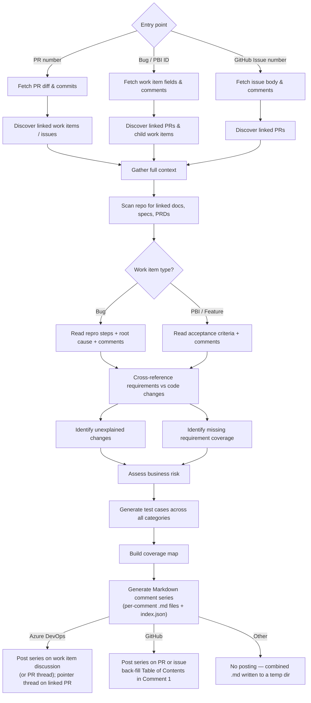

The **Test Strategist** plugin gathers everything needed to understand what was built — work item requirements, code changes across linked pull requests, comments, child items, and referenced documentation — then posts a **business-readable Markdown comment series** on the pull request, issue, or work item discussion that serves as the testing guide for a QA engineer doing risk-based testing.

The series is broken into a logical sequence of comments (typically 5–8). Each comment is self-contained and carries a `[k/N]` header. The first comment includes a Table of Contents that deep-links to every other comment in the series.

Reports are written for **QA engineers, product owners, and non-technical stakeholders**. Test cases describe _what_ to verify and _why it matters_ — not which line of code changed.

**Nothing is written to the repository working tree.** No HTML file, no `git status` noise, no need for `.gitignore` entries.

| What it produces | Description |
|---|---|
| **Requirements Coverage** | Checks every repro step, acceptance criterion, or feature description against actual code changes |
| **Developer Changes Requiring Clarification** | Highlights code changes that cannot be explained by the stated requirements — flagged for discussion before testing begins |
| **Risk Assessment** | Business-level risk summary — what could break, who is affected, and how severe the impact would be |
| **Where Testers Should Focus First** | The 3–5 highest-risk business areas with the test case IDs that cover them — the "first hour of testing" guide |
| **Functional Test Cases** | Scenario-level cases for happy paths, alternate flows, and boundary conditions, grounded in what the requirement actually asks for |
| **Performance Test Cases** | Load, soak, and concurrency scenarios inferred from the change and any SLOs in the repository — skipped automatically when there is no realistic performance surface |
| **Security Test Cases** | Authorisation boundaries, input validation, injection surfaces, and OWASP-relevant patterns for the touched code paths |
| **Privacy & PII Test Cases** | Personal data handling, consent, retention, deletion paths, logging leakage, and cross-border transfer surfaces |
| **Accessibility & Usability Test Cases** | Keyboard navigation, screen reader semantics, contrast, and error recovery — generated only for UI-touching changes |
| **Resilience Test Cases** | Timeout, retry, partial failure, idempotency, and graceful degradation scenarios for service-touching changes |
| **Compatibility Test Cases** | Browser, OS, device, API version, and integration contract scenarios — generated when the change touches a UI, public API, or shared integration point |
| **Coverage Map** | A matrix linking every requirement, risk, and matched incident to the test cases that cover it — gaps are explicit, not hidden |
| **QA Sign-off Checklist** | Interactive Markdown task list for the tester to confirm completion — checkboxes work natively on both GitHub and Azure DevOps |

Works with **GitHub** (Issues and Features) and **Azure DevOps** (Bugs and PBIs).

---

## How It Works



1. **Accept any entry point** — a PR number, a Bug/PBI ID, or a GitHub Issue number. The plugin resolves the rest automatically.
2. **Discover all linked context** — for a work item, finds linked and child PRs; for a PR, finds the linked work item or issue. Changesets attached to the work item are included.
3. **Enrich with repository documentation** — scans for PRDs, specs, and design notes under common paths (`/docs`, `/specs`, `/requirements`, `/design`) that the work item references.
4. **Read the right fields** — for Bugs: reproduction steps, root cause analysis, and comments; for PBIs and Features: acceptance criteria and comments.
5. **Cross-reference requirements against code** — every code change is matched to a requirement. Changes that cannot be explained are flagged for clarification. Requirements with no corresponding code change are surfaced as gaps.
6. **Assess business risk** — impact is described in terms of user workflows, data integrity, and business outcomes — not file paths or method names.
7. **Generate layered test cases** — functional, performance, security, privacy, accessibility, resilience, and compatibility scenarios are generated in proportion to the risk profile of the change. Categories with no realistic surface are skipped automatically.
8. **Build a coverage map** — a matrix that makes visible which requirements and risks each test case covers, and which are explicitly out of scope.
9. **Publish as a Markdown comment series** — the report is split into a logical sequence of comments and posted on the platform:
   - **GitHub**: each comment is posted on the PR or issue. After every comment is posted, the plugin captures the per-comment `#issuecomment-NNN` URL and back-fills the Table of Contents in Comment 1 so every other comment is reachable in one click.
   - **Azure DevOps**: the series is posted on the linked work item's discussion (preferred) or on the PR thread directly when there is no linked work item. When the series is on the work item, a single pointer thread is posted on each linked PR so reviewers can navigate to the discussion. The Table of Contents in Comment 1 is back-filled the same way.
   - **Other**: no posting. The per-comment `.md` files plus a combined `impact-analysis-report.md` are written to a temp directory (`${TMPDIR:-/tmp}/test-strategy-…/`) — the repository working tree stays clean.

---

## Comment Series Structure

A typical run produces **5 to 8 comments**. Categories with no realistic surface (and categories suppressed by `--no-perf` / `--no-a11y`) are skipped — they do not get a comment.

| # | Comment Title | Always Present? | Contents |
|---|---|---|---|
| 1 | `[1/N] Overview & Focus Areas` | Yes | Work item header, headline business risk, **Where Testers Should Focus First** (top 3–5 high-risk business areas with the TC-IDs that cover them), test case count summary, linked PRs, **Table of Contents** (back-filled with comment URLs after posting) |
| 2 | `[2/N] Risk & Impact` | Yes | Business Risk Assessment (overall + risk matrix + What Could Go Wrong), Impacted Areas, Code Changes Overview (per-PR, in collapsible blocks) |
| 3 | `[3/N] Requirements & Gaps` | Yes | Requirements Coverage, Developer Changes Requiring Clarification, Missing Requirement Coverage, Context Gathered (linked PRs, child work items, changesets, referenced docs) |
| 4..N-1 | `[k/N] Test Cases: <Category>` | Per non-empty category | One comment per non-empty category (🟢 Functional → 🔵 Performance → 🔴 Security → 🟡 Privacy → 🟣 Accessibility → ⚪ Resilience → 🟤 Compatibility). Each test case is wrapped in a `<details>` block for scannability. Long categories are split at a test-case boundary into `Part 1 of 2`, `Part 2 of 2`, etc. |
| N | `[N/N] Coverage Map & QA Sign-off` | Yes | Coverage Map (req → TC, risk → TC, explicitly out of scope), Environment & Assignment, **QA Sign-off** as an interactive Markdown task list |

Each comment is held under **50 KB** so it fits comfortably within both GitHub's (~64 KB) and Azure DevOps' (~150 KB) per-comment body limits.

---

## Test Case Anatomy

Every test case is a self-contained set of instructions a manual tester can run without reading the code. Each one is rendered inside a `<details>` block (so the per-category comment stays scannable) and includes:

| Field | Purpose |
|---|---|
| **ID + title** | Sequential `TC-NNN` and a plain-language scenario starting with a verb the user performs |
| **Why this matters** | One or two sentences in a `> 💡 Why this matters:` blockquote — business outcome verified if it passes; business loss if it fails; affected users |
| **Linked to** | The requirement (`AC` / `RS`) **and** the business risk (`Risk-N`) this case covers — no orphan test cases |
| **User role / persona** | The specific kind of user running the scenario |
| **Preconditions** | System state, environment, feature flags, existing data |
| **Test data** | A Markdown table of concrete copy-pasteable sample values, with boundary / PII / PCI / invalid flags in the Notes column |
| **Steps** | Numbered observable user actions — no code references |
| **Expected business outcome** | What the user sees and what the business gains |
| **How to verify** | Where the tester looks: UI cues, emails, records (technical hints permitted only here) |
| **If this fails** | What evidence to capture, which risk it confirms, who to escalate to |

### Test Data Generation

The plugin generates concrete, synthetic test data for every test case — the tester can copy and paste it. Generation covers:

- **Identifiers** — `*.test@example.com` / `Test-NNNN` patterns
- **Money / quantity** — currency-correct values around any thresholds (just below / at / just above)
- **Dates / times** — relative to "today", with edge dates (DST, leap day, far past / future) where relevant
- **Free-text** — short, long, with apostrophes ("O'Brien"), with non-ASCII (José, 王芳)
- **Geographic data** — postal codes, phone numbers in the system's actual format
- **Payment data** — known test cards (`4242 4242 4242 4242` for success, `4000 0000 0000 9995` for declined) — never real card numbers
- **Boundary values** — minimum, just below, maximum, just above, empty, whitespace, special characters, format-invalid (marked with `🎯 boundary`)
- **Negative test data** — expired coupons, blocked customers, oversized uploads, SQL/script-like strings, role-escalation attempts (marked with `⚠️ invalid`)
- **PII / PCI / PHI tags** — every sensitive field is flagged in the test data table (`🔒 PII`, `💳 PCI`, `🩺 PHI`)

Performance, accessibility, resilience, and compatibility test cases include category-specific extras (load profile, assistive technology, failure simulation, target browsers / OS / API versions).

---

## Entry Points

The plugin accepts three entry points. Only one is needed — the agent resolves the rest.

| Entry Point | Example Prompt | What the agent does |
|---|---|---|
| **PR number** | `/test-strategy pr 87` | Fetches the PR diff, then discovers the linked work item or issue to read requirements |
| **Azure DevOps Bug or PBI ID** | `/test-strategy wi 4521` | Fetches the work item fields and comments, then discovers all linked and child PRs |
| **GitHub Issue number** | `/test-strategy issue 203` | Fetches the issue body and comments, then discovers all linked pull requests |

When triggered automatically via a Xianix Agent rule, the entry point is supplied by the webhook payload — no manual input is needed.

---

## Inputs

| Input | Source | Required | Description |
|---|---|---|---|
| Entry point ID | Agent rule or prompt | Yes | PR number, work item ID, or issue number |
| Repository URL | Agent rule | Yes | Used to fetch diffs, linked items, and repository documentation |
| `--no-perf` flag | Prompt | No | Skip performance test case generation |
| `--no-a11y` flag | Prompt | No | Skip accessibility test case generation |

The platform (GitHub or Azure DevOps) is **auto-detected** from the repository URL — you do not need to specify it.

---

## Sample Prompts

**Analyse the current branch (agent infers PR from active branch):**

```text
/test-strategy
```

**Analyse a specific pull request:**

```text
/test-strategy pr 87
```

**Analyse an Azure DevOps Bug or PBI by work item ID:**

```text
/test-strategy wi 4521
```

**Analyse a GitHub Issue:**

```text
/test-strategy issue 203
```

**Analyse a work item and skip performance tests:**

```text
/test-strategy wi 4521 --no-perf
```

---

## Test Case Categories

Test cases are written in plain language. Every scenario includes: what to do, what data to use, and what the expected outcome looks like from a user's perspective. Technical implementation details are intentionally excluded.

| Category | Scope | When generated |
|---|---|---|
| 🟢 **Functional** | Happy paths, alternate flows, and boundary conditions derived from acceptance criteria, repro steps, comments, and linked specification documents | Always |
| 🔵 **Performance** | Load, soak, and concurrency scenarios; latency budgets inferred from requirements and any SLOs in the repository | When the change touches a service, query, or data pipeline with realistic performance exposure |
| 🔴 **Security** | Authorisation and authentication boundaries, input validation, injection surfaces, secrets handling, and OWASP-relevant patterns for the touched paths | When the change touches authentication, data input, API surfaces, or permission logic |
| 🟡 **Privacy & PII** | Personal data flows, consent and purpose-limitation checks, data retention and deletion paths, logging and telemetry leakage, and cross-border transfer surfaces | When the change handles personal, financial, or health data |
| 🟣 **Accessibility & Usability** | Keyboard navigation paths, screen reader semantics, colour contrast, error recovery, and empty/error state behaviour | When the change touches any user interface |
| ⚪ **Resilience** | Timeout handling, retry behaviour, partial failure recovery, idempotency, and graceful degradation | When the change touches a service call, queue, or external dependency |
| 🟤 **Compatibility** | Browser, OS, device, screen size, API version, and third-party integration compatibility — verifies the change does not break existing consumers or supported environments | When the change touches a UI, a public API, an integration point, or a contract shared with other systems |

Each category gets its **own dedicated comment** in the series, ordered Functional → Performance → Security → Privacy → Accessibility → Resilience → Compatibility. Within each comment, test cases are ordered Critical → High → Medium → Low.

---

## Developer Changes Requiring Clarification

Any code change that cannot be mapped to a stated requirement is surfaced in **Comment 3 (Requirements & Gaps)**, before any test cases — so the tester knows to pause and seek clarification rather than guess scope. Each flagged change includes:

| Field | What it contains |
|---|---|
| **What changed (in business terms)** | Plain-language description of the user-visible effect, even if subtle (logging, error message, audit detail) |
| **Where it shows up** | Workflow, screen, or integration affected |
| **Hypothesis** | What the agent believes the intent is, if it can be inferred |
| **Question for the developer** | The specific thing the tester needs answered before this area can be tested |
| **Status** | 🟣 Needs Clarification — must be resolved before this area is tested |

### Clarification Categories

Each item is tagged with a category emoji to help the developer triage at a glance:

| Emoji | Category | Meaning |
|---|---|---|
| 🔧 | **Refactoring** | Structural change with no new behaviour |
| 📊 | **Observability** | Logging, metrics, or monitoring additions |
| 🧹 | **Housekeeping** | Dependency updates, linting, config changes |
| 🔄 | **Tech-Debt** | Known technical debt remediation |
| ➕ | **Undocumented Feature** | New behaviour not mentioned in requirements |
| 🔀 | **Scope Creep** | Change that appears outside the scope of this work item |

If every code change maps cleanly to a stated requirement, this section is replaced with a single line — _"No unexplained changes — every code change maps to a stated requirement."_ — and no warning box is shown.

---

## Coverage Map

The coverage map is in the **final comment of the series** and shows:

- Which acceptance criteria or repro steps each test case covers
- Which identified risks each test case mitigates
- Which items are deliberately marked out of scope (and why)
- Any requirement or risk with no test case — surfaced as a gap with severity

The coverage map is **honest**: hidden gaps are worse than missing tests, so requirements without coverage and risks without mitigation are listed explicitly with a specific reason ("No price-rounding logic found in any linked PR" — not "uncovered").

---

## Environment Variables

The Xianix Agent reads these from its secrets store and injects them at runtime via the rule's `with-envs` block (see the rule examples below). For local CLI use, export them in your shell.

| Variable | Platform | Required | Purpose |
|---|---|---|---|
| `AZURE-DEVOPS-TOKEN` | Azure DevOps | Yes | PAT for REST API — fetches work items, PRs, changesets, and posts the comment series |
| `GITHUB-TOKEN` | GitHub | Yes | Authenticate `gh` CLI for fetching issues, PRs, and posting the comment series |

### Azure DevOps Token Permissions

| Permission | Access | Why it's needed |
|---|---|---|
| **Work Items** | Read & Write | Fetch fields, repro steps, acceptance criteria, root cause, and comments; post and edit the comment series on the work item discussion |
| **Code** | Read | Access PR diffs, file history, commit details, and changesets |
| **Pull Requests** | Read & Write | Fetch PR metadata, navigate work item ↔ PR links, and post the pointer thread (or full series) on the PR |

### GitHub Token Permissions

| Permission | Access | Why it's needed |
|---|---|---|
| **Contents** | Read | Access repository contents, commits, and documentation files |
| **Metadata** | Read | Search repositories and access repository metadata |
| **Issues** | Read & Write | Fetch issue body, labels, and comments; post and edit the comment series on issues |
| **Pull requests** | Read & Write | Fetch PR diffs, navigate issue ↔ PR links, and post and edit the comment series on PRs |

---

## Quick Start

```bash
# Point Claude Code at the plugin
claude --plugin-dir /path/to/xianix-plugins-official/plugins/test-strategist

# Then in the chat — start from a PR, a work item, or a GitHub issue
/test-strategy pr 87
/test-strategy wi 4521
/test-strategy issue 203
```

### Local CLI Prerequisites

When running the plugin from your own machine (rather than via the Xianix Agent), make sure these are available on your `PATH`:

| Tool | Required for | Install |
|---|---|---|
| `git` | All platforms | Pre-installed on most systems |
| `jq` | All platforms (used by every provider for JSON munging and API response parsing) | `brew install jq` (macOS) · `apt install jq` (Linux) · `winget install jqlang.jq` (Windows) |
| `gh` | GitHub | `brew install gh` (macOS) · `apt install gh` (Linux) · `winget install GitHub.cli` (Windows) |
| `curl` | Azure DevOps | Pre-installed on most systems |

Verify:

```bash
git --version
jq --version
gh auth status               # GitHub only
echo "$AZURE-DEVOPS-TOKEN"   # Azure DevOps only
```

Or trigger it automatically via the Xianix Agent by adding a rule — see the examples below and the [Rules Configuration](/agent-configuration/rules/) guide.

---

## Rule Examples

The Test Strategist supports **two independent trigger paths** on both platforms:

- **PR-based trigger** — tag a pull request with `ai-dlc/pr/test-strategy` to analyse from the PR inward to the linked work item or issue.
- **Work item / issue trigger** — tag a Bug, PBI, or GitHub Issue with `ai-dlc/wi/test-strategy` to analyse from the requirement outward across all linked PRs.

Both paths produce the same comment series. Choose whichever fits your team's workflow, or use both.

### When does the agent trigger?

| Platform | Entry point | Scenario | Webhook event | Filter rule |
|---|---|---|---|---|
| GitHub | PR | Tag newly applied | `pull_request` | `action==labeled` and `label.name=='ai-dlc/pr/test-strategy'` |
| GitHub | PR | PR opened with tag | `pull_request` | `action==opened` and `ai-dlc/pr/test-strategy` is in `pull_request.labels` |
| GitHub | PR | New commits to tagged PR | `pull_request` | `action==synchronize` and `ai-dlc/pr/test-strategy` is in `pull_request.labels` |
| GitHub | Issue | Tag newly applied | `issues` | `action==labeled` and `label.name=='ai-dlc/wi/test-strategy'` |
| GitHub | Issue | Issue closed with tag | `issues` | `action==closed` and `ai-dlc/wi/test-strategy` is in `issue.labels` |
| Azure DevOps | PR | Tag newly applied | `git.pullrequest.updated` | `message.text` contains `tagged the pull request` and `ai-dlc/pr/test-strategy` is in `resource.labels` |
| Azure DevOps | PR | PR created with tag | `git.pullrequest.created` | `ai-dlc/pr/test-strategy` is in `resource.labels` |
| Azure DevOps | PR | New commits to tagged PR | `git.pullrequest.updated` | `message.text` contains `updated the source branch` and `ai-dlc/pr/test-strategy` is in `resource.labels` |
| Azure DevOps | Work item | Tag newly applied | `workitem.updated` | `message.text` contains `tagged the work item` and `ai-dlc/wi/test-strategy` is in `resource.labels` |
| Azure DevOps | Work item | Work item resolved | `workitem.resolved` | `ai-dlc/wi/test-strategy` is in `resource.labels` |

### Execution-block shape

Each execution block in `rules.json` follows this top-level shape:

| Field | Purpose |
|---|---|
| `name` | Human-readable id for the execution |
| `platform` | `"github"` or `"azuredevops"` — drives which provider the plugin uses |
| `repository.url` | Webhook path to the repository URL (e.g. `repository.clone_url`, `resource.repository.remoteUrl`). Omit the entire `repository` block for Azure DevOps **work items** — the work item itself is not bound to a single repo. |
| `repository.ref` | Optional. Webhook path to the branch ref (e.g. `pull_request.head.ref`, `resource.sourceRefName`). Used only for PR-style entries. |
| `match-any` | Array of trigger filters — first one to match wins |
| `use-inputs` | **Minimal** — usually just the entry-point id (e.g. `pr-number`, `issue-number`, `work-item-id`). The repository URL and ref are injected automatically from the `repository` block. |
| `use-plugins` | The plugin to invoke |
| `with-envs` | Required environment variables, sourced from the agent's `secrets.*` store and marked `mandatory: true` |
| `execute-prompt` | The prompt sent to the agent. Implicit interpolations: `{{repository-name}}` and `{{git-ref}}` from the `repository` block, plus any `name` from `use-inputs` |

---

### GitHub — PR trigger

```json
{
  "name": "github-pull-request-test-strategy",
  "platform": "github",
  "repository": {
    "url": "repository.clone_url",
    "ref": "pull_request.head.ref"
  },
  "match-any": [
    {
      "name": "github-pr-tag-applied",
      "rule": "action==labeled&&label.name=='ai-dlc/pr/test-strategy'"
    },
    {
      "name": "github-pr-opened-with-tag",
      "rule": "action==opened&&pull_request.labels.*.name=='ai-dlc/pr/test-strategy'"
    },
    {
      "name": "github-pr-synchronize-with-tag",
      "rule": "action==synchronize&&pull_request.labels.*.name=='ai-dlc/pr/test-strategy'"
    }
  ],
  "use-inputs": [
    { "name": "pr-number", "value": "number" }
  ],
  "use-plugins": [
    {
      "plugin-name": "test-strategist@xianix-plugins-official",
      "marketplace": "xianix-team/plugins-official"
    }
  ],
  "with-envs": [
    { "name": "GITHUB-TOKEN", "value": "secrets.GITHUB-TOKEN", "mandatory": true }
  ],
  "execute-prompt": "Pull request #{{pr-number}} in {{repository-name}} (branch: {{git-ref}}) has been tagged for test strategy generation.\n\nRun /test-strategy pr {{pr-number}} to generate the impact analysis and post the test strategy comment series on the pull request."
}
```

### GitHub — Issue trigger

```json
{
  "name": "github-issue-test-strategy",
  "platform": "github",
  "repository": {
    "url": "repository.clone_url"
  },
  "match-any": [
    {
      "name": "github-issue-tag-applied",
      "rule": "action==labeled&&label.name=='ai-dlc/wi/test-strategy'"
    },
    {
      "name": "github-issue-closed-with-tag",
      "rule": "action==closed&&issue.labels.*.name=='ai-dlc/wi/test-strategy'"
    }
  ],
  "use-inputs": [
    { "name": "issue-number", "value": "issue.number", "mandatory": true }
  ],
  "use-plugins": [
    {
      "plugin-name": "test-strategist@xianix-plugins-official",
      "marketplace": "xianix-team/plugins-official"
    }
  ],
  "with-envs": [
    { "name": "GITHUB-TOKEN", "value": "secrets.GITHUB-TOKEN", "mandatory": true }
  ],
  "execute-prompt": "Issue #{{issue-number}} in {{repository-name}} has been tagged for test strategy generation.\n\nRun /test-strategy issue {{issue-number}} to generate the impact analysis and post the test strategy comment series on the issue."
}
```

### Azure DevOps — PR trigger

```json
{
  "name": "azuredevops-pull-request-test-strategy",
  "platform": "azuredevops",
  "repository": {
    "url": "resource.repository.remoteUrl",
    "ref": "resource.sourceRefName"
  },
  "match-any": [
    {
      "name": "azuredevops-pr-tag-applied",
      "rule": "eventType==git.pullrequest.updated&&message.text*='tagged the pull request'&&resource.labels.*.name=='ai-dlc/pr/test-strategy'"
    },
    {
      "name": "azuredevops-pr-created-with-tag",
      "rule": "eventType==git.pullrequest.created&&resource.labels.*.name=='ai-dlc/pr/test-strategy'"
    },
    {
      "name": "azuredevops-pr-source-branch-updated-with-tag",
      "rule": "eventType==git.pullrequest.updated&&resource.labels.*.name=='ai-dlc/pr/test-strategy'&&message.text*='updated the source branch'"
    }
  ],
  "use-inputs": [
    { "name": "pr-number", "value": "resource.pullRequestId" }
  ],
  "use-plugins": [
    {
      "plugin-name": "test-strategist@xianix-plugins-official",
      "marketplace": "xianix-team/plugins-official"
    }
  ],
  "with-envs": [
    { "name": "AZURE-DEVOPS-TOKEN", "value": "secrets.AZURE-DEVOPS-TOKEN", "mandatory": true }
  ],
  "execute-prompt": "Pull request #{{pr-number}} in {{repository-name}} (branch: {{git-ref}}) has been tagged for test strategy generation.\n\nRun /test-strategy pr {{pr-number}} to generate the impact analysis and post the test strategy comment series — on the linked work item's discussion if one is linked, otherwise on the PR thread."
}
```

### Azure DevOps — Work item trigger

```json
{
  "name": "azuredevops-workitem-test-strategy",
  "platform": "azuredevops",
  "match-any": [
    {
      "name": "azuredevops-wi-tag-applied",
      "rule": "eventType==workitem.updated&&message.text*='tagged the work item'&&resource.labels.*.name=='ai-dlc/wi/test-strategy'"
    },
    {
      "name": "azuredevops-wi-resolved",
      "rule": "eventType==workitem.resolved&&resource.labels.*.name=='ai-dlc/wi/test-strategy'"
    }
  ],
  "use-inputs": [
    { "name": "work-item-id", "value": "resource.workItemId", "mandatory": true }
  ],
  "use-plugins": [
    {
      "plugin-name": "test-strategist@xianix-plugins-official",
      "marketplace": "xianix-team/plugins-official"
    }
  ],
  "with-envs": [
    { "name": "AZURE-DEVOPS-TOKEN", "value": "secrets.AZURE-DEVOPS-TOKEN", "mandatory": true }
  ],
  "execute-prompt": "Work item #{{work-item-id}} has been tagged for test strategy generation.\n\nRun /test-strategy wi {{work-item-id}} to generate the impact analysis and post the test strategy comment series on the work item discussion. A pointer thread will also be posted on each linked PR."
}
```

:::note
These blocks go inside the `executions` array of a rule set. See [Rules Configuration](/agent-configuration/rules/) for the full file structure and filter syntax.
:::
