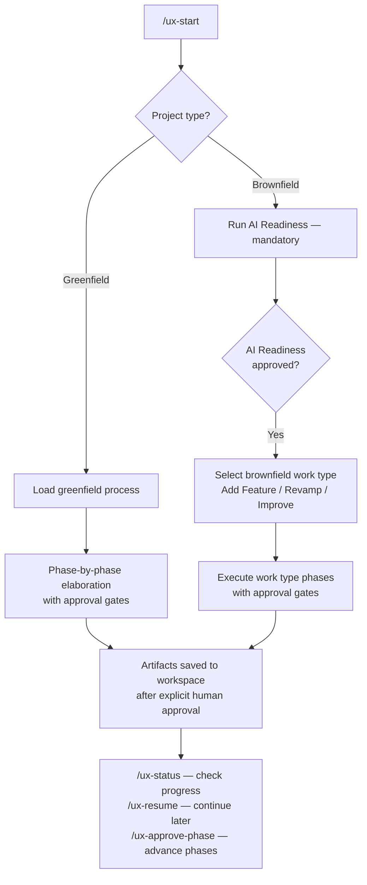

The **UX Mob Process** plugin brings AI-native UX elaboration into Claude Code as a structured, human-gated workflow. It guides product teams through phased design sessions — from domain analysis to handoff artifacts — enforcing strict approval gates, context isolation, and governance guardrails at every step. No artifact is saved and no phase advances without explicit human approval.

It supports two project categories: **Greenfield** (starting from scratch) and **Brownfield** (evolving an existing product), with a mandatory AI Readiness assessment before any brownfield work begins.

---

## What You Get Back

Each completed session produces a set of structured artifacts saved to your project workspace under `[workspace-root]/projects/[project-folder]/`:

| Artifact | Greenfield | Brownfield |
|---|---|---|
| `domain.md` | Phase 1 | AI Readiness Phase 3 |
| `personas.md` / `user-groups-and-roles.md` | Phase 2 | AI Readiness Phase 4 |
| `executable-product-intent.md` | Phase 3 | — |
| `client-input.md`, `intent-gap.md`, `client-verification.md` | Phases 4–6 | — |
| `feature-map.md` | Phase 9 | AI Readiness Phase 5 |
| `user-journeys.md` / `current-user-journeys.md` | Phase 10 | AI Readiness Phase 7 |
| `units.md` + `unit-validation-cases.md` | Phases 11–12 | Post-AI-Readiness work types |
| `design.md` | Phase 13 | — |
| `outputs/ui-prompts/` | Phase 14 | — |
| `greenfield-handoff.md` / brownfield work type artifacts | Phase 16 | Post-readiness |
| `decisions/` (assumptions register, decision log, do-not-invent list, drift register) | All phases | All phases |
| `outputs/ai-readiness/` (11 readiness artifacts) | — | AI Readiness |

Every artifact is previewed in chat before saving. Saving an artifact does **not** approve the phase — they are separate explicit gates.

---

## How It Works



**Greenfield (16 phases):**

1. **Domain Analysis** — domain.md: terminology, industry context, regulatory patterns.
2. **Persona Analysis** — personas.md: user groups, goals, pain points.
3. **Executable Product Intent** — the "why" and outcomes behind the product.
4. **Client Input Capture** — structured capture of client-provided requirements.
5. **Intent Gap Analysis** — gaps between client input and product intent.
6. **Client Verification & Scope Agreement** — explicit scope sign-off with the client.
7. **Intent Cleanup / Scope Removal** — removes out-of-scope items from active artifacts.
8. **MVP Scope Suggestion** *(optional)* — suggests a minimal viable scope cut.
9. **Feature Map** — prioritized feature list with in/out-of-scope status.
10. **User Journeys** — end-to-end flows per persona across features.
11. **AI-DLC Unit Definition** — product units derived from approved feature map and journeys.
12. **Unit Validation Cases** — traceability cases from each unit to a product source.
13. **Design Direction** — visual language, component guidance, and UI personality.
14. **UI Prompt Generation** — one AI design prompt per user journey.
15. **Design Review & Corrective Prompts** *(optional)* — reviews generated designs against heuristics and validation cases.
16. **Handoff** — consolidated handoff document for implementation.

**Brownfield (AI Readiness first — 11 phases, then work type):**

The AI Readiness phase captures the existing product context before any changes begin: artifact audit, product brief, domain, user groups & roles, feature map, navigation map, current user journeys, design system context, product rules/constraints/do-not-invent list, AI context pack, and readiness approval. Only after readiness is approved can a brownfield work type (Add New Feature / Complete Revamp / Improve Existing Feature) begin.

---

## Commands

| Command | What it does |
|---|---|
| `/ux-start [greenfield \| brownfield]` | Initialize a new UX Mob session. Prompts for project type, name, and workspace path. |
| `/ux-start-fresh` | Start with strict context isolation — guarantees no prior run outputs or archived artifacts leak in. |
| `/ux-resume [project-folder]` | Resume a paused session from the last approved phase in `project-state.json`. |
| `/ux-status [project-folder]` | Show the current project status: active phase, completed phases, saved artifacts, and open questions. |
| `/ux-run-ai-readiness` | Run (or re-run) the Brownfield AI Readiness assessment standalone. Required before any brownfield work type begins. |
| `/ux-approve-phase` | Record explicit phase approval after running the Phase Quality Checklist and advance to the next phase. |
| `/ux-validate-guardrails` | Run a full governance compliance check and output a Guardrail Validation Report. |
| `/ux-validate-context-drift` | Check whether any unapproved context from prior runs has leaked into the active session. |
| `/ux-run-matrix` | Run only the UX Matrix module to generate a prioritized feature-persona matrix from approved artifacts. |

---

## Governance & Guardrails

The plugin enforces a strict governance framework throughout every session. These rules cannot be bypassed silently — violations cause the agent to stop and ask the human how to proceed.

**Strict No-Silent-File-Write Rule** — the agent must never write an artifact to disk without first showing the full proposed content in chat and receiving explicit save approval. This applies to every file in the project workspace.

**Artifact Save ≠ Phase Approval** — saving a file and approving a phase are two separate explicit confirmations. A human can save all drafts in a phase and still revise before marking the phase complete.

**Context Isolation Rule** — each new session treats the project as isolated. Prior mob runs, archived artifacts, old conversation memory, and unapproved files from outside the active project folder may not be used without explicit human authorization.

**Template Enforcement Rule** — before generating any artifact, the agent reads the relevant template and preserves its heading structure exactly. Missing content is marked `Needs human input`, assumptions as `Assumption`, and inferred content as `Inferred`.

**Mandatory Brownfield AI Readiness** — brownfield projects must complete and receive human approval on AI Readiness before a work type (Add New Feature, Complete Revamp, Improve Existing Feature) may begin.

**Long-Artifact Preview Rule** — for large artifacts, the agent must offer section-by-section preview rather than dumping the full content in one block. The human reviews and approves each section before the artifact is assembled and saved.

**Do-Not-Invent Rule** — the agent may not invent domain knowledge, business rules, user context, or product decisions. If information is missing, it must ask the human or mark it explicitly rather than filling in the gap.

---

## Project Workspace Layout

When a session is initialized, the plugin creates this structure outside the plugin directory:

```
[workspace-root]/projects/[project-folder]/
├── project-state.json                     # Phase state, approvals, artifact registry
├── outputs/
│   ├── *.md                               # Greenfield artifacts (domain, personas, etc.)
│   ├── ai-readiness/                      # Brownfield AI Readiness artifacts
│   ├── ui-prompts/                        # One UI prompt file per user journey
│   └── corrective-prompts/                # Design review corrective prompts
├── phase-artifacts/                       # Phase-specific artifacts (e.g., ux-matrix output from /ux-run-matrix)
├── decisions/
│   ├── do-not-invent-list.md
│   ├── assumptions-register.md
│   ├── decision-log.md
│   ├── ai-drift-register.md
│   └── guardrail-validation-report.md
└── archives/                              # Prior run artifacts (brownfield revivals)
```

:::note
The plugin never writes inside its own directory. All project artifacts go to the workspace root you specify at session start.
:::

---

## Sample Session

```text
# Start a new Greenfield project
/ux-start greenfield

# Check where you are at any point
/ux-status

# After reviewing and approving a phase
/ux-approve-phase

# Pause and come back later
/ux-resume my-project-folder

# Run a compliance check on all saved artifacts
/ux-validate-guardrails
```

For a Brownfield project, AI Readiness runs automatically first:

```text
/ux-start brownfield
# → AI Readiness runs for 11 phases before work type is selected

# Or run AI Readiness standalone on an existing project
/ux-run-ai-readiness
```

---

## Quick Start

**Install the plugin** (one-time setup — choose one):

```bash
# Option A: copy to your Claude Code plugins directory
cp -r /path/to/ux-mob-process-plugin ~/.claude/plugins/ux-mob-process-plugin

# Option B: register it in your .claude.json
# Add "ux-mob-process-plugin" to the "plugins" array pointing at the folder path
```

Reload Claude Code, then verify the plugin loaded:

```text
/ux-status
# Should respond: [ux-mob-process] loaded
```

**Start a session:**

```bash
# Greenfield session
/ux-start greenfield

# Brownfield session (AI Readiness runs first)
/ux-start brownfield
```

You will be prompted for a project name, project folder name, and workspace root path. The plugin initializes the workspace and begins the first phase immediately.

---

## Plugin Architecture

The plugin is composed of agents, skills, and a session hook. You don't invoke these directly — the commands wire them together automatically.

**Agents:**

| Agent | Role |
|---|---|
| `ux-mob-facilitator` | Primary orchestrator. Routes to Greenfield or Brownfield process, enforces approval gates and governance rules throughout. |
| `greenfield-process-agent` | Executes all 16 Greenfield phases with per-phase routing and special rules. |
| `brownfield-ai-readiness-agent` | Runs the 11-phase AI Readiness assessment and unlocks brownfield work type selection on completion. |
| `design-review-agent` | Executes the optional Phase 15 design review using Nielsen's 10 usability heuristics and generates corrective prompts. |
| `context-drift-validator-agent` | Read-only auditor. Validates context isolation and produces a Context Drift Report. |
| `artifact-auditor-agent` | Read-only auditor. Checks draft artifacts against template structure, source declarations, and labeling requirements before save approval. |

**Skills:**

| Skill | Role |
|---|---|
| `ux-mob-process-runner` | Core execution loop: project initialization, phase routing, approval gates, artifact saves, and resume-from-state. |
| `brownfield-ai-readiness` | Guides the 11-phase AI Readiness flow with artifact existence checks and reconstruction rules. |
| `ux-guardrail-validator` | Full compliance validation across phase sequencing, source-of-truth chains, scope rules, and labeling requirements. |

**Hook:** On session start, the plugin prints `[ux-mob-process] loaded — run '/ux-start' to begin a Greenfield or Brownfield UX Mob session.` — a quick confirmation that the plugin is active.

---

## Rule Examples

Add the execution block below to your `rules.json` to run UX Mob sessions directly inside an **Agent Studio chat conversation**.

### Execution-block shape

| Field | Purpose |
|---|---|
| `name` | Human-readable identifier for this rule |
| `match-any` | Trigger filter — `x-xianix-chat-trigger?` activates the rule from an Agent Studio chat |
| `use-plugins` | The plugin to load, referenced by name and marketplace URL |
| `model` | Claude model to use for the session |
| `max-budget-usd` | Maximum spend cap for the session |
| `max-turns` | Maximum conversation turns before the session closes |
| `execute-prompt` | The opening prompt sent to the agent when the session starts |

### Agent Studio Chat

```json
{
  "name": "chat-ux-mob-process",
  "match-any": [
    {
      "name": "chat-only-stub",
      "rule": "x-xianix-chat-trigger?"
    }
  ],
  "use-plugins": [
    {
      "plugin-name": "ux-mob-process@xianix-plugins-official",
      "marketplace": "xianix-team/plugins-official"
    }
  ],
  "model": "claude-sonnet-4-5",
  "max-budget-usd": 2,
  "max-turns": 150,
  "execute-prompt": "Run /ux-mob-process:ux-start to begin the UX Mob process. Ask the user whether this is a Greenfield or Brownfield project if not already stated."
}
```

:::note
The UX Mob Process is designed as an **interactive, human-gated workflow**. A human must remain present in the session to review drafts and approve each phase. The agent will not proceed autonomously past any approval gate.
:::
