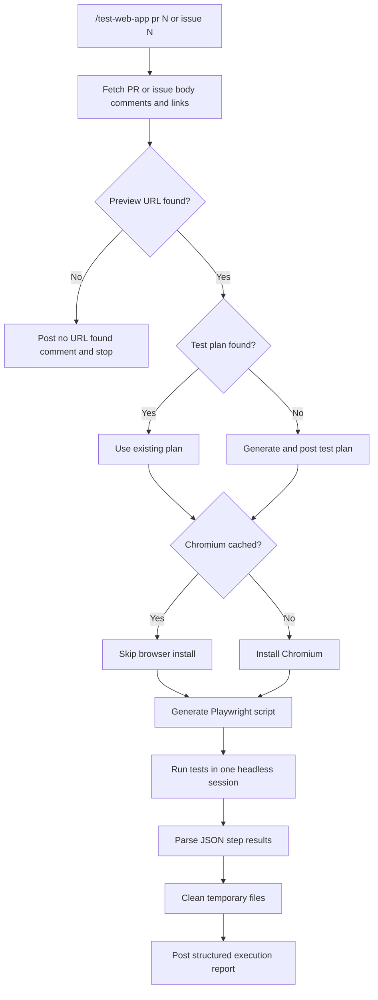

The **Web App Tester** plugin validates web app behavior for a GitHub pull request or issue by running browser-based checks with **Playwright** in headless Chromium.

It is **PR/Issue-driven**: point it to a PR or issue, it discovers a testable preview URL from discussion content, finds (or generates) a test plan, executes the steps in a single browser session, and posts a structured results comment.

Single command: **`/test-web-app`**

---

## How It Works



1. **Gather context** - reads PR or issue title/body, comments, and linked references through `gh` CLI.
2. **Find test URL** - searches for a testable URL (for example `Preview URL:` or `Staging URL:`). If none is found, it posts a comment and stops.
3. **Find or generate test plan** - uses an existing structured plan from comments, or generates one from context and posts it first.
4. **Prepare Playwright** - reuses cached Chromium if available; installs once when needed.
5. **Execute steps** - runs one generated Playwright script in a single headless browser session, with retry handling for transient failures.
6. **Publish report** - posts one structured test execution report back to the PR or issue.

---

## Inputs

| Input | Source | Required | Description |
|---|---|---|---|
| Target ID | Command argument | Yes | PR number (`pr 42`) or issue number (`issue 88`) |
| Test URL | PR/issue content | Yes | URL marked as preview/staging/test environment |
| Test plan | PR/issue content | No | Numbered or bulleted verification steps; generated if missing |

Platform is currently **GitHub**.

---

## Sample Prompts

**Test a specific PR:**

```text
/test-web-app pr 42
```

**Test a specific issue:**

```text
/test-web-app issue 88
```

**Infer PR from current branch context:**

```text
/test-web-app
```

---

## Execution Statuses

| Status | Meaning |
|---|---|
| PASSED | Step executed and expected outcome observed |
| FAILED | Step executed but expected outcome not observed |
| BLOCKED | Step could not execute after retries, or was skipped due to read-only safety mode |

Overall result is:

- **PASSED** when all steps pass
- **FAILED** when one or more steps fail
- **BLOCKED** when any step cannot be safely or reliably executed

---

## Safety Rules

- If no test URL is found, the plugin posts a comment and exits.
- If the URL appears to be production, the run switches to **read-only mode** and skips state-changing actions.
- Credentials and tokens are never posted in comments.
- Temporary files are deleted after the run.

---

## Report Output

The plugin posts one comment with:

- URL tested
- total step count
- per-step status table
- overall result
- failure or blocked step details (with captured screenshot reference when available)

This keeps the output concise and immediately reviewable inside the PR or issue timeline.

---

## Quick Start

```bash
# Point Claude Code at the plugin
claude --plugin-dir /path/to/xianix-plugins-official/plugins/web-app-tester

# Then in chat
/test-web-app pr 42
```

For setup details (Node.js and `gh` CLI), see the plugin setup guide in the repository:

<https://github.com/xianix-team/plugins-official/tree/main/plugins/web-app-tester/docs/setup.md>

---

## What Is Included

| Path | Purpose |
|---|---|
| `commands/test-web-app.md` | Entry command and argument pattern |
| `agents/orchestrator.md` | End-to-end orchestration flow |
| `providers/github.md` | GitHub fetch/post operations |
| `styles/report-template.md` | Strict output report format |
| `hooks/validate-prerequisites.sh` | Node.js and `gh` availability checks |
| `docs/setup.md` | Installation and auth setup |
