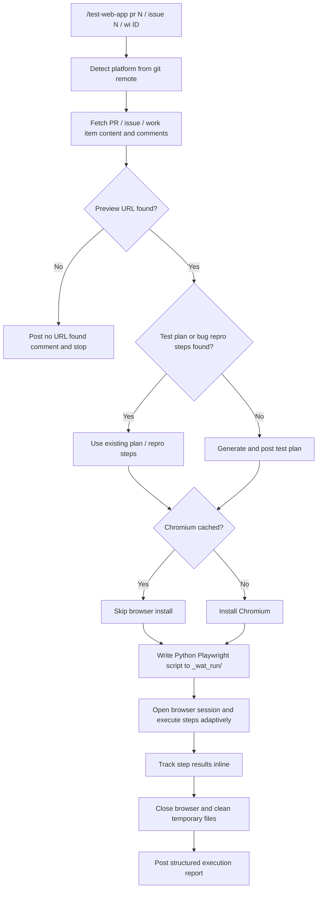

The **Web App Tester** plugin validates web app behavior for a GitHub or Azure DevOps pull request, issue, or work item by running browser-based checks with **Playwright** in headless Chromium.

| Phase | What it does |
| --- | --- |
| **Gather context** | Detects the platform, fetches PR/issue/work item content, finds the test URL, and retrieves or generates a test plan |
| **Run Playwright** | Opens a headless session, executes steps adaptively with retries, and captures screenshots |
| **Post report** | Computes the verdict and posts a structured execution report as a comment on the PR, issue, or work item |

Works with **GitHub** and **Azure DevOps**.

---

## How It Works



1. **Detect platform** — reads `git remote get-url origin` to determine GitHub or Azure DevOps and routes all fetch/post operations to the correct provider.
2. **Gather context** — reads PR/issue/work item title, body, comments, and linked references. For Azure DevOps `wi` entry: extracts bug repro steps as the test plan seed and discovers the linked PR for URL lookup and report posting.
3. **Find test URL** — searches for a testable URL (for example `Preview URL:` or `Staging URL:`). If none is found, it posts a comment and stops.
4. **Find or generate test plan** — uses an existing structured plan from comments (including plans generated by `test-strategist`), or generates one from context and posts it first. For ADO Bugs, repro steps are used directly as the plan if they contain structured action verbs.
5. **Prepare Playwright** — reuses cached Chromium if available; installs once when needed.
6. **Execute steps** — writes an instrumented Python/Playwright script, executes it in a single `python3` call, and parses structured `STEP_RESULT|...` log lines; failures are self-verified against captured screenshots, with retry logic for transient failures.
7. **Publish report** — posts one structured test execution report back to the PR, issue, or work item. For ADO `wi` entry with a linked PR: posts the full report on the PR thread and a brief notification comment on the work item.

---

## Inputs

| Input | Source | Required | Description |
| --- | --- | --- | --- |
| Target ID | Command argument | Yes | GitHub: PR number (`pr 42`) or issue number (`issue 88`). Azure DevOps: PR number (`pr 42`) or work item ID (`wi 1234`) |
| Test URL | PR/issue/work item content | Yes | URL marked as preview/staging/test environment |
| Test plan | PR/issue/work item content | No | Numbered or bulleted verification steps; generated if missing. For ADO Bugs, repro steps are used as the seed. |

The platform is auto-detected from the git remote URL — no configuration needed.

---

## Sample Prompts

**Test a GitHub PR:**

```text
/test-web-app pr 42
```

**Test a GitHub issue:**

```text
/test-web-app issue 88
```

**Test an Azure DevOps PR:**

```text
/test-web-app pr 42
```
*(The plugin auto-detects Azure DevOps from the git remote — same command, different platform.)*

**Test an Azure DevOps Bug (work item):**

```text
/test-web-app wi 1234
```
*(Extracts repro steps as the test plan, finds the linked PR for the deployment URL, posts the full report on the PR and a notification on the bug.)*

**Infer PR from current branch context:**

```text
/test-web-app
```

---

## Environment Variables

The Xianix Agent reads these from its secrets store and injects them at runtime via the rule's `with-envs` block. For local CLI use, export them in your shell.

| Variable | Platform | Required | Purpose |
| --- | --- | --- | --- |
| `GITHUB-TOKEN` | GitHub | Yes | Authenticate `gh` CLI for fetching PR/issue data and posting comments |
| `AZURE-DEVOPS-TOKEN` | Azure DevOps | Yes | PAT for the ADO REST API — reading PRs/work items and posting comments |
| `ENVIRONMENT` | Both | No | Set to `production` to enable read-only mode — all state-changing steps are skipped and marked BLOCKED |

### GitHub Token Permissions

| Permission | Access | Why it's needed |
| --- | --- | --- |
| **Contents** | Read | Access repository contents |
| **Metadata** | Read | Search repositories and access repository metadata |
| **Pull requests** | Read & Write | Fetch pull request context and post test execution reports |
| **Issues** | Read & Write | Fetch issue context and post test execution reports |

### Azure DevOps PAT Permissions

Create the token in **User Settings → Personal access tokens** with the following scopes:

| Scope | Access | Why it's needed |
| --- | --- | --- |
| **Work Items** | Read & Write | Fetch bug repro steps and acceptance criteria; post notification comments on work items |
| **Code** | Read | Access PR metadata, threads, and linked work items |
| **Pull Requests** | Read & Write | Fetch PR content and post the test execution report |

---

## Execution Statuses

| Status | Meaning |
| --- | --- |
| PASSED | Step executed and expected outcome observed |
| FAILED | Step executed but expected outcome not observed |
| BLOCKED | Step could not execute after retries, was skipped because `ENVIRONMENT=production` read-only mode is active, or was halted by an auth gate with no credentials available |

Overall result is:

- **PASSED** when all steps pass
- **FAILED** when one or more steps fail
- **BLOCKED** when any step cannot be safely or reliably executed

---

## Safety Rules

- If no test URL is found, the plugin posts a comment and exits.
- Set `ENVIRONMENT=production` to switch to **read-only mode**, which skips all state-changing actions (destructive test cases are marked BLOCKED).
- Credentials and tokens are never posted in comments.
- Temporary files (the `_wat_run/` working directory) are deleted after every run, even if execution fails.

---

## Report Output

The plugin posts one comment with:

- URL tested
- total step count
- per-step status table
- overall result
- failure or blocked step details (with captured screenshot reference when available)

This keeps the output concise and immediately reviewable inside the PR, issue, or work item timeline.

---

## Quick Start

```bash
# Point Claude Code at the plugin
claude --plugin-dir /path/to/xianix-plugins-official/plugins/web-app-tester

# Then in chat
/test-web-app pr 42
```

Or trigger it automatically via the Xianix Agent by adding a rule — see the examples below and the [Rules Configuration](/agent-configuration/rules/) guide.

For setup details (Python 3.10+, Playwright Python package, `gh` CLI, and Azure DevOps PAT), see the plugin setup guide in the repository:

<https://github.com/xianix-team/plugins-official/tree/main/plugins/web-app-tester/docs/setup.md>

---

## Rule Examples

Add the execution block below to your `rules.json` so the Xianix Agent automatically tests web apps when a webhook fires.

### When does the agent trigger?

The Web App Tester is mainly **tag-driven**. It runs when the `ai-dlc/pr/test-web-app` label is present on a pull request and one of the scenarios below fires (OR logic across `match-any` entries).

| Scenario | What it covers |
| --- | --- |
| PR opened / created with the tag already present | A PR is opened with the tag included from the start |
| New commits pushed to a tagged PR | The PR source branch is updated while the tag is still on the PR |
| Tag newly applied to a PR | A human (or another rule) adds `ai-dlc/pr/test-web-app` to an open PR |

| Platform | Scenario | Webhook event | Filter rule |
| --- | --- | --- | --- |
| GitHub | Tag newly applied | `pull_request` | `action==labeled` and `label.name=='ai-dlc/pr/test-web-app'` |
| GitHub | PR opened with tag | `pull_request` | `action==opened` and `ai-dlc/pr/test-web-app` is in `pull_request.labels` |
| GitHub | New commits to tagged PR | `pull_request` | `action==synchronize` and `ai-dlc/pr/test-web-app` is in `pull_request.labels` |

### Execution-block shape

Each execution block in `rules.json` follows this top-level shape:

| Field | Purpose |
| --- | --- |
| `name` | Human-readable id for the execution |
| `platform` | `"github"` or `"azure-devops"` — drives which provider the plugin uses |
| `repository.url` | Webhook path to the repository URL (e.g. `repository.clone_url`) |
| `repository.ref` | Webhook path to the branch ref (e.g. `pull_request.head.ref`) |
| `match-any` | Array of trigger filters — first one to match wins |
| `use-inputs` | **Minimal** — usually just the entry-point id (e.g. `pr-number`). The repository URL and ref are injected automatically from the `repository` block. |
| `use-plugins` | The plugin to invoke |
| `with-envs` | Required environment variables, sourced from the agent's `secrets.*` store and marked `mandatory: true` |
| `execute-prompt` | The prompt sent to the agent. Implicit interpolations: `{{repository-name}}` and `{{git-ref}}` from the `repository` block, plus any `name` from `use-inputs` |

### GitHub

```json
{
  "name": "github-web-app-test",
  "platform": "github",
  "repository": {
    "url": "repository.clone_url",
    "ref": "pull_request.head.ref"
  },
  "match-any": [
    {
      "name": "github-pr-tag-applied",
      "rule": "action==labeled&&label.name=='ai-dlc/pr/test-web-app'"
    }
  ],
  "use-inputs": [
    { "name": "pr-number", "value": "pull_request.number" }
  ],
  "use-plugins": [
    {
      "plugin-name": "web-app-tester@xianix-plugins-official",
      "marketplace": "xianix-team/plugins-official"
    }
  ],
  "with-envs": [
    { "name": "GITHUB-TOKEN", "value": "secrets.GITHUB-TOKEN", "mandatory": true }
  ],
  "execute-prompt": "You are testing pull request {{pr-number}}. Run /test-web-app pr {{pr-number}} to perform the automated web app test."
}
```

### Azure DevOps

```json
{
  "name": "ado-web-app-test",
  "platform": "azure-devops",
  "repository": {
    "url": "resource.url",
    "ref": "resource.targetRefName"
  },
  "match-any": [
    {
      "name": "ado-pr-tag-applied",
      "rule": "eventType==git.pullrequest.updated&&resource.status=='active'"
    }
  ],
  "use-inputs": [
    { "name": "pr-number", "value": "resource.pullRequestId" }
  ],
  "use-plugins": [
    {
      "plugin-name": "web-app-tester@xianix-plugins-official",
      "marketplace": "xianix-team/plugins-official"
    }
  ],
  "with-envs": [
    { "name": "AZURE-DEVOPS-TOKEN", "value": "secrets.AZURE-DEVOPS-TOKEN", "mandatory": true }
  ],
  "execute-prompt": "You are testing pull request {{pr-number}}. Run /test-web-app pr {{pr-number}} to perform the automated web app test."
}
```

:::note
These blocks go inside the `executions` array of a rule set. See [Rules Configuration](/agent-configuration/rules/) for the full file structure and filter syntax.
:::

---

## What Is Included

| Path | Purpose |
| --- | --- |
| `commands/test-web-app.md` | Entry command and argument pattern |
| `agents/orchestrator.md` | End-to-end orchestration flow |
| `providers/github.md` | GitHub fetch/post operations via `gh` CLI |
| `providers/azure-devops.md` | Azure DevOps fetch/post operations via REST API |
| `styles/report-template.md` | Strict output report format |
| `hooks/validate-prerequisites.sh` | Python 3.10+, `playwright` Python package, and platform CLI availability checks |
| `docs/setup.md` | Installation and auth setup |
